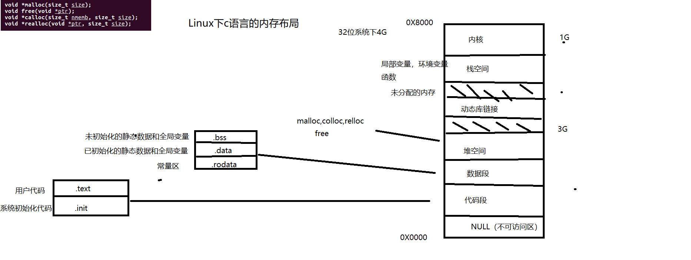

[TOC]
# C语言查缺补漏 以《c primer plus》为主

## 基础

>### 赋值运算符： 赋值运算符的返回值为赋值本身（从右至左运算）

```c
//example
int a = 100;
int x = a = 90;
//结果为 x = 90，其中x的值为a = 90,为这个运算符的返回值
//在系统编程中的案例
if((len = read(fd,buf,sizeof(buf))) != 0)
// 此时比较的是 0 与 len = read(fd,buf,sizeof(buf))这个赋值运算符的返回值
```

>### 逗号表达式： 逗号表达式的值为最后一个表达式的值（从左至右运行）

```c
//example
void func()
{
    int a = 10;
    int b = 10, c, d, e;
    int r = (b++, c++, d + 3, e = b + c, ++a);
    printf("a=%d,b=%d,c=%d,d=%d,e=%d,r=%d\n",a,b,c,d,e,f,r);
}
// 其中r为最后一个表达式++a的值

void f3()
{
    int a = 10;
    int b = 20;
    int r = (a++, b++);
    printf("a=%d,b=%d,r=%d", a, b, r);
}
// 其中r的值为b，先赋值再执行++操作
```

>### 位运算符

& 与，| 或，！非 ，^ 异或


#### 应用场景

- 打开位

    将需要的位 置1，而其他位不变

    使用或运算

    与0或，值不变

    与1或，值为1

    ```c
    flag = flag | mask
    flag |= mask
    ```

- 关闭位（清空位）

    将需要的位 置0，而其他位不变

    使用与运算

    与0与，值为0

    与1与，值不变

    使用打开位时使用的掩码而不攻更改掩码值，可以使用下面的示例

    ```c
    flag = flag & ~mask
    flag &= ~mask
    ```

- 切换位

    将需要的位 置反

    使用异或运算

    与0异或，值为它本身

    与1异或，值为相反值
    
    ```c
    flag = flag ^ mask
    flag ^= mask
    ```


> 移位运算符

右移 >>
(1) 无符号右移 补0
(2) 有符号右移 补符号位

左移 <<
均补0

```c
// example
char i = 127; // 0111 1111
char j = -1;  // 1111 1111
unsigned char k = 255; // 1111 1111

//左移 补0
i << 1;  // 0111 1111 -> 1111 1110
j << 1;  // 1111 1111 -> 1111 1110
k << 1;  // 1111 1111 -> 1111 1110

//右移  补符号位
i >> 1;  // 0111 1111 -> 0011 1111
j >> 1;  // 1111 1111 -> 1111 1111
k >> 1;  // 1111 1111 -> 0111 1111 
```

> register 和 auto

- register和auto都是只能声明局部变量，不能声明全局变量
- 局部变量存储在栈中
- 使用register定义的变量，没有内存地址，无法对其进行取地址操作
```c
// example
int i; // ==> auto int i;   使用auto时，可以省略auto
register int j; // register不能省略，使用该关键字的变量存储一般在寄存器
int *p = &j; //将会报错 error: address of register variable ‘j’ requested
```

>### 多文件编译

extern关键字，.h文件, 与条件编译
[详细解析](https://www.runoob.com/w3cnote/extern-head-h-different.html)

函数的声明可以不用加extern

```c
// 全局变量的声明与定义
extern int a; // 声明一个全局变量 a
int a; // 定义一个全局变量 a
extern int a =0 ; // 定义一个全局变量 a 并给初值。
int a =0;    // 定义一个全局变量 a, 并给初值，
```

example
```c
// main.c
#include <stdio.h>
#include "func.h"
int main(int argc, char *argv[])
{ 
    func1();
    func2();
    printf("%d\n",a);
    return 0;
} 
```

```c
// func.c
#include <stdio.h>
#include "func.h"  // 被调用文件应该导入自己的头文件，以至于无视函数间的顺序

int a = 1;
void func1(){
    printf("this is func1\n");
}
void func2(){
    printf("this is func2\n");
}
```

```c
// func.h
#ifndef FUNC_H  // 条件编译命令在预处理时起作用
#define FUNC_H  

void func1();
void func2();
extern int a;

#endif
```

## 指针

> 指针变量的定义
```
基本指针变量
[存储类型] 数据类型 *变量名

数组指针arr
[存储类型] 数据类型 (*变量名)[数组步长]

存储指针的数组
[存储类型] 数据类型 *变量名[数组大小]

函数指针
```
> 指针和多维数组

```c
int arr[5][2];
```
`arr`是数组`arr[2]`的首地址，该数组有5个元素

`arr[0]`是数组`(arr[0])[2]`的首地址，该数组有2个元素

下面，从指针的角度进行分析:

因为`arr`是数组首元素的地址，所以`arr`的值和`&arr[0]`的值相同。 而`arr[0]`本身是一个内含两个整数的数组，所以`arr[0]`的值和它首元素 (一个整数)的地址(即`&arr[0][0]`的值)相同。简而言之，`arr[0]`是一个占用一个`int`大小**对象**的地址，而`arr`是一个占用两个`int`大小**对象**的地 址。由于这个整数和内含两个整数的数组都开始于同一个地址，所以`arr` 和`arr[0]`的值相同。

给指针或地址加1，其值会增加对应类型大小的数值。在这方面，`arr` 和`arr[0]`不同，因为`arr`指向的对象占用了两个`int`大小，而`arr[0]`指向的 对象只占用一个`int`大小。因此，`arr + 1`和`arr[0] + 1`的值不同。

解引用一个指针（在指针前用\*运算符）或在数组名后使用带下标的`[]`运算符，得到引用对象代表的值。

因为`arr[0]`是该数组首元素(`arr[0] [0]`)的地址，所以`*(arr[0])`表示储存在`arr[0][0]`上的值(即一个`int`类型 的值)。与此类似，`*arr`代表该数组首元素(`arr[0]`)的值，但是 `arr[0]`本身是一个int类型值的地址。该值的地址是`&arr[0][0]`，所以 `*arr`就是`&arr[0][0]`。

对两个表达式应用解引用运算符表明，`**arr`与 `*&arr[0][0]`等价，这相当于`arr[0][0]`，即一个int类型的值。简而言之， `arr`是地址的地址，必须解引用两次才能获得原始值。地址的地址或指针的指针是就是双重间接(double indirection)的例子。

因此`arr`的数据类型从指针的角度来看为`int **arr`,而`arr[0]`的数据类型从指针的角度来看为`int *arr`

```c
// 一维数组
int arr[5];
int *p;

//二维数组
int arr[5][4];         // arr[5] == &arr[5][0]  类型为 int *
int (*p)[4];

//三维数组
int arr[5][4][3];
int (*p)[4][3];


```


> const 修饰符

虽然`#define`指令可以创建类似功能的符号常量，但是const的用法更加灵活。除了基本数据类型之外，还可以创建`const数组`，`const指针`，`指向const的指针`

c标准规定：使用非`const`标识符修改`const`数据导致的结果是未定义的

判断`const`作用的关键在于看`const`相对于*运算符的位置

const数组
```c
[存储类型] const 数据类型 变量名[]
[存储类型] 数据类型 const 变量名[]
```

指向const的指针
```c
[存储类型] const 数据类型 * 变量名  //效果和const数组类似
[存储类型] 数据类型 const * 变量名
```

const指针
```c
[存储类型]  数据类型 * const 变量名  
```

两个const的指针
```c
[存储类型] const 数据类型 * const 变量名
[存储类型] 数据类型 const *  const 变量名
```


> 对形式参数使用const，以保证传入函数的数据不被修改

```c
int func1(const int arr[]){
    printf("%p %p\n", arr, arr++);
    arr[1] = 1;  //报 error: assignment of read-only location ‘*(arr + 1)’
    printf("%s", arr);
}
//  在这种情况下，arr为指向const的指针，指针的值可变，指针指向的值不可变

int func2(const int const arr[]){
    printf("%p %p\n", arr, arr++);
    arr[1] = 1;  //报 error: assignment of read-only location ‘*(arr + 1)’
    printf("%s", arr);
}
//  在该定义中，效果同上，指针的值可变，指针指向的值不可变  arr[] => *(arr)

int func3(const int *arr){
    printf("%p %p\n", arr, arr++);
    arr[1] = 1;  
    printf("%s", arr);
}
//  在该定义中，效果同上，指针的值可变，指针指向的值不可变

int func4(int * const arr){
    printf("%p %p\n", arr, arr++);
    arr[1] = 1;  
    printf("%s", arr);
}
//  在该定义中，形参声明为常量指针，指针的值不可变，指针指向的值可变

int func5(const int * const arr){
    printf("%p %p\n", arr, arr++);
    arr[1] = 1;  
    printf("%s", arr);
}
//  在该定义中，形参声明为常量指针，且指向的值也是常量，指针的值，指针指向的值均不可变
```

结果如下


## 复杂类型声明

[类型转英文描述](https://cdecl.org/)

## 位域

声明
```c
struct box{
    bool opa: 3
    int a : 26;
    int b : 7;
    int c;
};
```
在结构体定义时，我们可以指定某个成员变量所占用的二进制位数（Bit），这就是位域。
:后面的数字用来限定成员变量占用的位数。成员 c 没有限制，根据数据类型即可推算出它占用 4 个字节（Byte）的内存。成员 a、b 被:后面的数字限制，不能再根据数据类型计算长度，它们分别占用 26、7 位（Bit）的内存。

声明为位域的数据类型无法获取其地址


## 存储类别，链接和内存管理

linux下c语言程序内存布局


### 存储类别

> 链接

c变量有三种属性的链接：
- 外部链接
- 内部链接
- 无链接

具有块作用域、函数作用域或函数原型作用域的变量都是无链接 变量。这意味着这些变量属于定义它们的块、函数或原型私有。具有文件作用域的变量可以是外部链接或内部链接。
判断文件作用域变量是否为内部链接可以通过查看有无`static`存储类别修饰符


> 块作用域的静态变量

静态变量指的是存储地址的静态属性，而不是不可修改其值

可以 创建具有静态存储期、块作用域的局部变量。这些变量和自动变量一样，具 有相同的作用域，但是程序离开它们所在的函数后，这些变量不会消失。也 就是说，这种变量具有块作用域、无链接，但是具有静态存储期。计算机在 多次函数调用之间会记录它们的值。在块中(提供块作用域和无链接)以存 储类别说明符static(提供静态存储期)声明这种变量。


> 外部链接的静态变量

外部链接的静态变量具有文件作用域、外部链接和静态存储期。该类别 有时称为外部存储类别(external storage class)，属于该类别的变量称为外 部变量(external variable)。把变量的定义性声明(defining declaration)放 在在所有函数的外面便创建了外部变量。当然，为了指出该函数使用了外部 变量，可以在函数中用关键字extern再次声明。如果一个源代码文件使用的 外部变量定义在另一个源代码文件中，则必须用extern在该文件中声明该变 量。


> 内部链接的静态变量

该存储类别的变量具有静态存储期、文件作用域和内部链接。在所有函数外部(这点与外部变量相同)，用存储类别说明符static定义的变量具有这种存储类别

这种变量过去称为外部静态变量(external static variable)，但是这个 术语有点自相矛盾(这些变量具有内部链接)。但是，没有合适的新简称， 所以只能用内部链接的静态变量(static variable with internal linkage)。普通 的外部变量可用于同一程序中任意文件中的函数，但是内部链接的静态变量 只能用于同一个文件中的函数。可以使用存储类别说明符 extern，在函数中 重复声明任何具有文件作用域的变量。

> 关键概念

C 提供多种管理内存的模型。除了熟悉这些模型外，还要学会如何选择 不同的类别。大多数情况下，最好选择自动变量。如果要使用其他类别，应 该有充分的理由。通常，使用自动变量、函数形参和返回值进行函数间的通 信比使用全局变量安全。但是，保持不变的数据适合用全局变量。应该尽量理解静态内存、自动内存和动态分配内存的属性。尤其要注意:静态内存的数量在编译时确定;静态数据在载入程序时被载入内存。在程序运行时，自动变量被分配或释放，所以自动变量占用的内存数量随着程序的运行会不断变化。可以把自动内存看作是可重复利用的工作区。动态分配的内存也会增加和减少，但是这个过程由函数调用控制，不是自动进行的。


## 结构和其他数据类型  (struct enum union)

### 结构体的声明与定义 struct

```c
// 声明
struct NODE{  
    int a;
    int b;
};

struct{     // 使用无标记的声明的同时必须定义
    int a;
    int b;
};

typedef struct{
    int a;
    int b;
}NODE;

// 定义
struct NODE{
    int a;
    int b;
}node, *_node;

struct{
    int a;
    int b;
}node, *_node;   // 这种定义方法只能在声明时定义

```


**结构体的字节对齐**

在gcc version 11.3.0 (Ubuntu 11.3.0-1ubuntu1~22.04.1) 中，

结构体的内存占用大小为**最大基本数据类型**的整数倍（对齐基准）

在进行内存分配时，单字节类型(`char`)可以在任何位置对齐

两字节类型(`short`)应该对齐到一个两字节的边界。（一个两字节的边界为地址为2的整数倍）

四字节数(`int`)应与四字节边界对齐

八字节数(`long long`)应与八字节边界对齐


### 枚举的声明与定义 enum

```c
enum day{   // 声明了一个枚举类型
    one,
    two,
    three,
    four
};
// 数据之间用逗号分隔
// 如果定义时没有给枚举的内日那个赋值，那么默认第一个为0，之后的值递增
// 如果赋值后，后续内容递增

// 枚举类型的定义 赋值
enum day DAY;
DAY = one

```

```c
// 使用typedef时的声明 定义 与赋值
typedef enum {  // 声明枚举类型
    one,
    two,
    three,
    four
}DAY;

DAY day;  // 定义一个枚举变量
day = one; // 为枚举类型赋值

```


## STD I/O

```c
#include <stdio.h>
```

fopen
```c
FILE *fopen(const char *pathname, const char *mode);
// mode：打开的方式
// 	r：只读的方式打开
// 	r+：读写的方式打开
// 	w：文件存在则清空，文件不存在则创建。以只写的方式打开
// 	w+：文件存在则清空，文件不存在则创建。以读写的方式打开
// 	a：文件存在则在文件末尾写入，文件不存在则创建。只写
// 	a+：文件存在则在文件末尾写入，文件不存在则创建。读写
FILE *fdopen(int fd, const char *mode);
// fd：要转换的文件描述符。
// mode：指定文件流的访问模式，可以是以下之一："r"（读取）、"w"（写入）、"a"（追加写入）和 "b"（二进制模式）。
// 函数返回一个指向 FILE 结构的指针，该结构代表了与给定文件描述符相关联的文件流。我们可以通过这个指针来执行各种文件操作，比如读取、写入、关闭等。
// 使用 fdopen 可以将底层的文件描述符绑定到高级的文件流，这样就可以使用标准库提供的更多文件操作函数，如 fprintf、fscanf 等，方便对文件进行读写操作。
FILE *freopen(const char *pathname, const char *mode, FILE *stream);
// 当调用 freopen 函数时，它会做以下操作：
// 打开或创建一个新的文件，这取决于提供的文件名和模式。
// 关联文件描述符（stdin、stdout 或 stderr）与新打开的文件。
// 返回指向 FILE 结构体的指针，以便后续对流的操作。
```

fgetc
```c
int fgetc(FILE *stream);
// 按流从文件中读取一个字符
int getc(FILE *stream); 
// getc() is equivalent to fgetc() except that it may be implemented as a macro which evaluates stream more  than once.
char *fgets(char *s, int size, FILE *stream);   // fgets 会读取行中的 \n
// str：指向字符数组的指针，用于存储读取的字符串数据。
// n：要读取的最大字符数（包括终止空字符）。
// stream：指向要读取的文件的指针。
// fgets 函数会从指定的文件流（通常是 stdin 标准输入流或打开的文件）中读取一行数据，并将其存储到提供的字符数组中。它会连同换行符一起读取并存储，因此可以处理包含空格的输入。
int getchar(void);
// 从标准输入中读取一个字符，通常用于清掉缓冲区中的\n
int ungetc(int c, FILE *stream);
// ungetc 常用于将字符推回到输入流中。它是在 <stdio.h> 头文件中声明的，并常用于在读取字符后进行回退操作。
```

fputc
```c
int fputc(int c, FILE *stream);
int putc(int c, FILE *stream);//  putc()  is equivalent to fputc() except that it may be implemented as a macro which evaluates stream more than once.
int fputs(const char *s, FILE *stream);
int putchar(int c);
int puts(const char *s);  // 会在字符串末尾自动加上\n
```

fprintf fscanf
```c
int printf(const char *format, ...);
int fprintf(FILE *stream, const char *format, ...);
int dprintf(int fd, const char *format, ...);
int sprintf(char *str, const char *format, ...);
int snprintf(char *str, size_t size, const char *format, ...);
```

fseek ftell
```c
int fseek(FILE *stream, long offset, int whence); // offste SEEK_SET, SEEK_CUR，或SEEK_END
long ftell(FILE *stream);
void rewind(FILE *stream);
int fgetpos(FILE *stream, fpos_t *pos);
int fsetpos(FILE *stream, const fpos_t *pos);
```


## 预处理器

### 宏函数

格式
```c
#define MAX(a, b) ((a) > (b) ? (a) : (b))
```

### 用宏参数创建字符串 #运算符

#运算符可以把记号转换成字符串, 在字符两边加上字符串
作用为可以在字符串中替换掉宏参数

```c
#define PSQR(X) printf("THE square of X is %d.\n", (X)*(X));   // 未使用#运算符，字符串中的X宏变量无法替换
#define PSQR(X) printf("THE square of "#X" is %d.\n", (X)*(X)); // 使用#运算符，成功替换字符串中的宏参数


调用 PSQR(y);
// 调用宏时，用 "y" 替换 #X
// ANSI C宇符串的串联特性将这些字符串与printf语句的其他字符串组合，生成最终的字符串。
// 例如
// printf"The square of ""y"" is %d.n",((y)*(y)));
// 然后，字符串串联功能将这了个相邻的字符串组合成一个字符串：
//   "The square of y is %d.\n"

```

### 预处理器粘合剂 ##运算符

##运算符可以把两个记号组合成一个记号

```c
#define XNAME(x) n##x

调用 int XNAME(1)
// 调用宏时， 用 1替换x
// 此时n##x 变为 n1
// 因此 ## 运算符的作用为将 ## 两边的字符粘合为一个记号
```

### 变参宏 ...和__VA_ARGS__

通过变参宏可以像函数一样，传入多个参数

```c
#define PR(...) printf(__VA_ARGS__)

// 调用  PR("a = %d,b = %d", a, b);
// 对于以上调用 __VA_ARGS__ 展开为3个参数
// 分别为 "a = %d,b = %d" a b
```


## 条件编译

```c
#undef  // 取消宏定义


// 条件编译
#ifdef 
#else 
#endif

#ifndef

#if 表达式
#elif


```


## blog

setbuf

io缓冲输出与内核缓冲

signal


多进程下的锁机制


