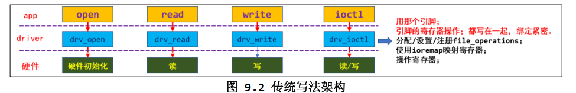
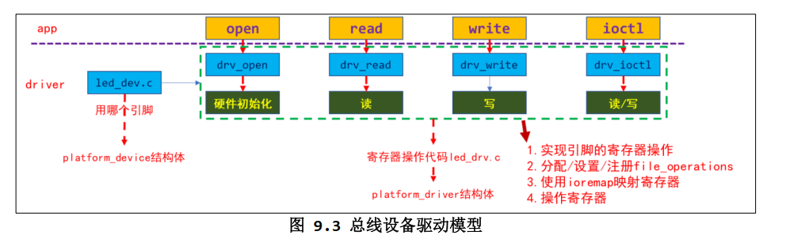

# linux_driver 理论篇

## 应用层和驱动的互交方式

### app和驱动
- copy_to_user()
- copy_from_user()

### 驱动和与硬件
- 各个子系统的函数
- 通过ioremap映射寄存器地址后，直接访问寄存器

### app使用驱动和的4中方式

驱动程序：提供能力，不提供策略
- 非阻塞(轮询)
- 阻塞(休眠-唤醒)
- poll(定时)
- 异步通知

## 字符设备驱动
https://tasks.josn/
### 简单的字符设备驱动框架

1. 确定主设备号，也可以让内核分配  int major;  major = 0 时自动分配
2. 定义自己的 file_operations 结构体
3. 实现对应的 drv_open/drv_read/drv_write 等函数，填入 file_operations 结构体
4. 把 file_operations 结构体告诉内核： register_chrdev
5. 谁来注册驱动程序啊？得有一个入口函数：安装驱动程序时，就会去调用这个入口函数
6. 有入口函数就应该有出口函数：卸载驱动程序时，出口函数调用 unregister_chrdev
7. 其他完善：提供设备信息，自动创建设备节点： class_create, device_crea


register_chrdev方式，register_chrdev会使用整个主设备号,使用简单，但占用资源较大
```c
#include <asm/uaccess.h>
#include <linux/err.h>
#include <linux/export.h>
#include <linux/kdev_t.h>
#include <linux/moduleparam.h>
#include <linux/printk.h>
#include <linux/stddef.h>
#include <linux/usb/cdc.h>
#include <linux/module.h>
#include <linux/fs.h>
#include <linux/errno.h>
#include <linux/miscdevice.h>
#include <linux/kernel.h>
#include <linux/major.h>
#include <linux/mutex.h>
#include <linux/proc_fs.h>
#include <linux/seq_file.h>
#include <linux/stat.h>
#include <linux/init.h>
#include <linux/device.h>
#include <linux/tty.h>
#include <linux/kmod.h>
#include <linux/gfp.h>

#define MIN(a, b) (a < b ? a : b)


// 1. 确定主设备号 0自动分配
static int major = 0;
static char kernel_buf[1024];
MODULE_LICENSE("GPL");

struct class* hello_class;


// 3. 填充file_operations
int hello_open (struct inode *node, struct file *file)
{
    printk("%s %s line %d", __FILE__, __FUNCTION__, __LINE__);
    return 0;
}
ssize_t hello_read (struct file *file, char __user *buf, size_t size, loff_t *l)
{
    int ret;
    printk("%s %s line %d", __FILE__, __FUNCTION__, __LINE__);
    ret = copy_to_user(buf, kernel_buf, MIN(1024, size));
    return ret;
}
ssize_t hello_write (struct file *file, const char __user *buf, size_t size, loff_t *l)
{
    int ret;
    printk("%s %s line %d", __FILE__, __FUNCTION__, __LINE__);
    ret = copy_from_user(kernel_buf, buf, MIN(1024, size));
    return ret;
}
int hello_close (struct inode *node, struct file *file)
{
    printk("%s %s line %d", __FILE__, __FUNCTION__, __LINE__);
    return 0;
}

// 2. 定义自己的 file_operations 结构体

struct file_operations operations= {
    .read = hello_read,
    .open = hello_open,
    .write = hello_write,
    .release = hello_close,
};

static int __init hello_drv_init(void)
{
    int err;

    printk("%s %s line %d\n", __FILE__, __FUNCTION__, __LINE__);

// 4. 申请设备号，并将模块添加到内核中
    major = register_chrdev(major, "hello", &operations);


    // 创建设备文件
    hello_class = class_create(THIS_MODULE, "hello_class");
    err = PTR_ERR(hello_class);
	if (IS_ERR(hello_class)) {
		printk("%s %s line %d\n", __FILE__, __FUNCTION__, __LINE__);
		unregister_chrdev(major, "hello");
		return -1;
	}

    device_create(hello_class, NULL, MKDEV(major, 0), NULL, "hello");

    return 0; 
}

// 6. 有入口函数就应该有出口函数：卸载驱动程序时，出口函数调用 unregister_chrdev
static void __exit hello_drv_exit(void)
{
    printk("%s %s line %d\n", __FILE__, __FUNCTION__, __LINE__);
    device_destroy(hello_class, MKDEV(major, 0));
    class_destroy(hello_class);
    unregister_chrdev(0, "hello");
}
// 7. 其他完善：提供设备信息，自动创建设备节点：class_create,device_create

module_init(hello_drv_init);
module_exit(hello_drv_exit);
```

自动创建设备节点
```c
drv_init()
{
    class_create();
    device_create();
}

drv_exit()
{
    device_destory();
    class_destory();
}

```


```makefile
# 1. 使用不同的开发板内核时, 一定要修改KERN_DIR
# 2. KERN_DIR中的内核要事先配置、编译, 为了能编译内核, 要先设置下列环境变量:
# 2.1 ARCH,          比如: export ARCH=arm64
# 2.2 CROSS_COMPILE, 比如: export CROSS_COMPILE=aarch64-linux-gnu-
# 2.3 PATH,          比如: export PATH=$PATH:/home/book/100ask_roc-rk3399-pc/ToolChain-6.3.1/gcc-linaro-6.3.1-2017.05-x86_64_aarch64-linux-gnu/bin 
# 注意: 不同的开发板不同的编译器上述3个环境变量不一定相同,
#       请参考各开发板的高级用户使用手册

KERN_DIR = /home/book/100ask_imx6ull-sdk/Linux-4.9.88

all:
	make -C $(KERN_DIR) M=`pwd` modules 
	$(CROSS_COMPILE)gcc -o hello_test hello.c 

clean:
	make -C $(KERN_DIR) M=`pwd` modules clean
	rm -rf modules.order
	rm -f hello_drv

obj-m	+= hello_drv.o

```

### 驱动设计的思想

- 面向对象

针对led驱动，字符设备驱动抽象出file_operations结构体，我们写的程序也可以抽象出led_operations结构体
```c
struct led_operations{
    int (*init) (int which);  // 根据次设备号初始化led
    int (*ctl) (int which, char status);
    int (*read) (int which, char* status);
    int (*release) (int which);
};
// 提供了一些方法，提供给上层使用。类似于java中类的方法
struct led_operations* get_board_led_opr(void);
int get_board_led_num(void);

```

- 分层

    将与硬件相关与硬件无关的代码分离
    

- 分离

    将不同的引脚操作进行分离，比如GPIO1与GPIO2的硬件设置不同就导致了相关的代码不同
    使用文件进行分离
    


## 驱动进化之路

驱动编写的三种写法
1. 传统写法

    
- 使用哪个引脚，怎么操作引脚，都写死在代码里
- 最简单，不考虑扩展性，可以快速实现功能
- 修改代码时，余姚重新编译

2. 总线设备驱动模型

    
- 引入platform_device/platform_driver,将‘资源’和‘驱动’分离开
- 代码稍微复杂，但是易于扩展
- 更换引脚时，图9.3中的led_drv.c基本不用改，但是需要修改led_dev.c

3. 设备树

    
- 通过配置文件──设备树来定义“资源”。
- 代码稍微复杂，但是易于扩展。
- 无冗余代码，修改引脚时只需要修改 dts 文件并编译得到 dtb 文件，把它传给内核。
- 无需重新编译内核/驱动。


### 总线设备驱动模型

#### deice与driver的匹配规则
- 最先比较
    - platform_device.driver_override 和 platform_driver.driver.name
    - 可以设置 platform_device 的 driver_override，强制选择某个 platform_driver。

- 然后比较
    - platform_device. name 和 platform_driver.id_table[i].name
    - Platform_driver.id_table 是“platform_device_id”指针，表示该 drv 支持若干个 device，它里面列出了各个 device 的{.name, .driver_data}，其中的“ name”表示该
drv 支持的设备的名字， driver_data 是些提供给该 device 的私有数据。

- 最后比较
    - platform_device.name 和 platform_driver.driver.name
    - platform_driver.id_table 可能为空，
这时可以根据 platform_driver.driver.name 来寻找同名的 platform_device。

#### 比较过城中的函数调用
```c
platform_device_register
platform_device_add()
    device_add()
        bus_add_device() // 放入链表
                bus_probe_device() // probe 枚举设备，即找到匹配的(dev, drv)
                    device_initial_probe()
                            __device_attach()
                                    bus_for_each_drv(...,__device_attach_driver,...)
                                        __device_attach_driver()
                                            driver_match_device(drv, dev) // 是否匹配
                                                driver_probe_device() // 调用 drv 的 probe
platform_driver_register()
__platform_driver_register()
    driver_register()
        bus_add_driver() // 放入链表
            driver_attach(drv)
                bus_for_each_dev(drv->bus, NULL, drv, __driver_attach);
                    __driver_attach()
                        driver_match_device(drv, dev) // 是否匹配
                            driver_probe_device() // 调用 drv 的 probe
```


#### 常用函数

##### 注册/反注册
```c
platform_device_register()/ platform_device_unregister()
platform_driver_register()/ platform_driver_unregister()
platform_add_devices() // 注册多个 device
```
##### 获得资源
返回该 dev 中某类型(type)资源中的第几个(num)：
```c
struct resource *platform_get_resource(struct platform_device *dev, unsigned int type, unsigned int num)
```
返回该 dev 所用的第几个(num)中断：
```c
int platform_get_irq(struct platform_device *dev, unsigned int num)
```
通过名字(name)返回该 dev 的某类型(type)资源：
```c
struct resource *platform_get_resource_byname(struct platform_device *dev,
unsigned int type,
const char *name)
```
通过名字(name)返回该 dev 的中断号：
```c
int platform_get_irq_byname(struct platform_device *dev， const char *name)
```

#### 怎么写程序
- 分配/设置/注册 platform_device 结构体
    - 在里面定义所用资源，指定设备名字。
- 分配/设置/注册 platform_driver 结构体
    - 在其中的 probe 函数里，分配/设置/注册 file_operations 结构体，
    - 并从 platform_device 中确实所用硬件资源。
    - 指定 platform_driver 的名字。


# linux_driver 实战篇

## 常用函数集合

### 驱动注册
```c

static inline int register_chrdev(unsigned int major, const char *name,
				  const struct file_operations *fops);
/*  
    作用： 申请设备号，创建设备节点，将操作函数绑定到设备节点
    参数：
        major: 主设备号，使用该函数将占用该主设备号下的所有的次设备节点 major == 0 将动态分配一个主设备号。
        name: 设备名称
        fops: 为设备注册的操作函数
    返回值：
        成功：主设备号
        失败： < 0
*/
static inline void unregister_chrdev(unsigned int major, const char *name);
/*  
    作用： 卸载调申请的设备节点
    参数：
        major: 主设备号
        name: 设备名称
*/
// 创建设备文件到文件系统
#define class_create(owner, name);
/*  
    作用： 申请设备号，创建设备节点，将操作函数绑定到设备节点
    参数：
        major: 主设备号，使用该函数将占用该主设备号下的所有的次设备节点 major == 0 将动态分配一个主设备号。
        name: 设备名称
        fops: 为设备注册的操作函数
    返回值：
        成功：主设备号
        失败： < 0
*/
struct device *device_create(struct class *class, struct device *parent,
			     dev_t devt, void *drvdata, const char *fmt, ...);

static inline void unregister_chrdev(unsigned int major, const char *name);

void device_destroy(struct class *class, dev_t devt)

void class_destroy(struct class *cls)
```

### 应用层与内核数据交互
```c
// 一般在read write函数使用 
unsigned long copy_from_user(void *to, const void __user *from, unsigned long n)；
/*  参数：
        to: 内核层内存地址地址
        from: 用户内存地址
        n: 复制的字节数
    返回值：
        复制成功的字节数
*/
unsigned long copy_to_user(void __user *to, const void *from, unsigned long n);
/*  参数：
        to: 用户层内存地址地址
        from: 内核内存地址
        n: 复制的字节数
    返回值：
        复制成功的字节数
*/

```

### gpio操作函数
```c
// 在linux中 gpio口可以通过cat /sys/kernel/debug/gpio命令查看
int gpio_request(unsigned gpio, const char *label);
/*  
    作用： 申请一个gpio，并为该gpio取一个名字
    参数：
        gpio: gpio号
        label: 为gpio取名
    返回值：
        失败： < 0
*/
static inline int gpio_direction_input(unsigned gpio);
/*  
    作用： 设置gpio口为输入模式
    参数：
        gpio: gpio号
    返回值：
        失败： < 0
*/
static inline int gpio_direction_output(unsigned gpio, int value);
/*  
    作用： 设置gpio口为输出模式，并且设置输出的初始值
    参数：
        gpio: gpio号
        vlaue: 为gpio设置值，一般为0 或 1
    返回值：
        失败： < 0
*/

int gpio_get_value(unsigned int gpio)
/*  
    作用： 获取gpio口的值
    参数：
        gpio: gpio号
    返回值：
        0 或 1
*/
void gpio_set_value(unsigned int gpio, int value);
/*  
    作用： 给gpio口设置值
    参数：
        gpio: gpio号
        label: gpio口的值 一般为 0 或 1
    返回值：
        复制成功的字节数
*/


int gpio_to_irq	(unsigned int irq, irq_handler_t handler, unsigned long flags, const char * name, void * dev)
/*  
    作用： 将gpio口注册为中断
    参数：
        irq: 申请的中断号
        handler： 中断处理函数
        flags： 监听中断触发的选项 IRQF_TRIGGER_RISING（上升沿） | IRQF_TRIGGER_FALLING（下降沿）
        name： 名字
        dev：调用中断时的传入参数
    返回值：
        失败 < 0
*/

void gpio_free(unsigned gpio);


```


### 中断
```c
void free_irq(unsigned int irq, void *dev_id)

```

### 异步通知
```c
void kill_fasync(struct fasync_struct **fp, int sig, int band);

int fasync_helper(int fd, struct file * filp, int on, struct fasync_struct **fapp)

```

### 定时

```c
int mod_timer(struct timer_list *timer, unsigned long expires)
udelay() 
static inline u64 ktime_get_ns(void)
int del_timer(struct timer_list *timer)


```


static DECLARE_WAIT_QUEUE_HEAD(gpio_wait);

#define wake_up_interruptible(x)


#define wait_event_interruptible(wq, condition)

static inline void poll_wait(struct file * filp, wait_queue_head_t * wait_address, poll_table *p)


