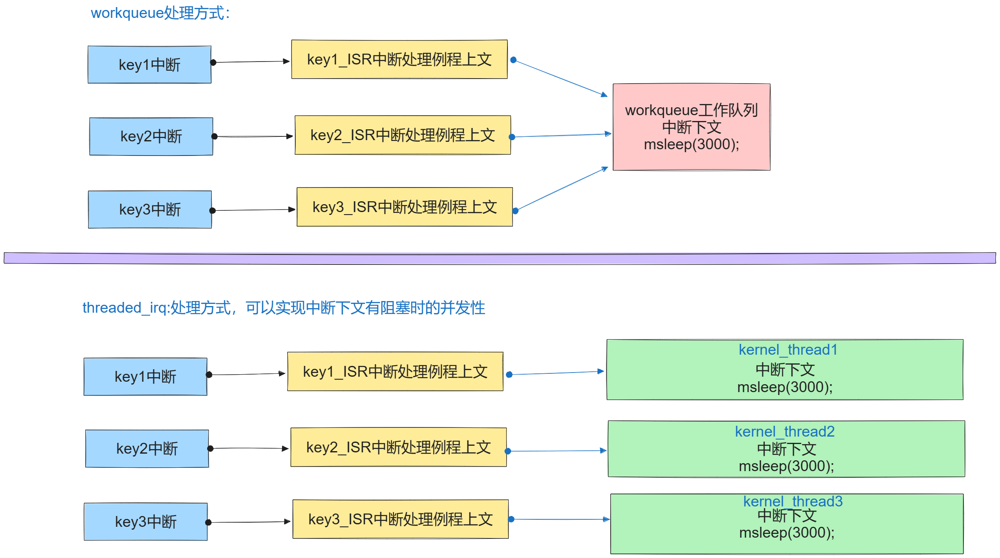

# 中断及中断子系统

## 1. 什么是中断

### 1.1 为什么要有中断

处理器速度很快，外围设备速度往往不在一个数量级上，如果处理器给硬件发出一个请求，再专门等回应，显然是浪费了cpu的处理其它事务的能力，所以采取当外围硬件处理好自己的事件，再来发请求的时候，处理器再回头处理它。

现在操作系统关于中断已经广义的说法了，对于系统而言，为了对进程的调度及状态切换，在系统软件层也实现了不依赖于中断控制器的软件中断，通常是程序通过特定指令（如x86架中的INT汇编指令，ARM架构中SWI汇编指令）主动触发的中断。比如允许用户程序请求操作系统提供服务的系统调用就是软件中断。

所以说中断是系统实现实时性的核心。

### 1.2 中断的分类

#### 1.2.1 硬件中断（Hardware Interrupt）

**定义：**硬件中断是由外部硬件设备（如键盘、鼠标、硬盘、网络接口等）产生的信号，通知CPU需要处理某个事件。硬件中断是异步的，因为它们可以在任何时候发生，不依赖于当前正在执行的指令序列。

**特点：**

1. 异步：不依赖于CPU当前执行的指令，可以在任何时候发生
2. 高优先级：通常比普通的程序执行优先级高，能够打断当前执行的指令序列
3. 响应速度快：硬件中断的设计目的是为了快速响应外部设备的请求

**应用场景：**

- 当键盘被按下时，生成键盘中断。
- 当网络接口接收到数据包时，生成网络中断。
- 硬盘读取或写入完成时，生成硬盘中断。

**处理过程**：（分配中断 保存现场,关中断  处理   回复现场）

1. 硬件设备发送中断信号给中断控制器，中断控制器分配CPU处理相应的中断任务。
2. CPU暂时停止当前的指令执行，保存当前状态。
3. CPU跳转到对应的中断处理程序（Interrupt Service Routine，ISR）来处理中断。
4. 处理完成后，恢复之前的状态并继续执行被打断的程序。

#### 1.2.2 软件中断（Software Interrupt）

**定义**：软件中断是由程序通过特定指令（如x86架构中的INT指令，ARM架构为SWI指令）主动触发的中断。软件中断通常用于操作系统提供的系统调用，允许用户程序请求操作系统提供的服务。

**特点**：

1. **同步：**由程序执行特定指令触发，发生在程序控制之内。
2. **可控性：**程序员可以决定何时触发软件中断。
3. **与硬件无关：**不依赖于外部硬件设备，完全由软件逻辑控制。

**应用场景**：

- 用户程序需要操作系统的服务（如文件读写、内存分配等）时，触发软件中断进行系统调用。
- 程序异常处理（如除零错误、非法访问等），通过软件中断处理异常情况。

**处理过程**：

1. 程序执行触发中断的指令。
2. CPU响应中断，保存当前状态。
3. CPU跳转到对应的中断处理程序（通常是操作系统提供的系统调用处理程序）。
4. 处理完成后，恢复之前的状态并继续执行程序。

#### 1.2.3对比总结

- **触发方式：**
  - 硬件中断：由外部硬件设备触发。
  - 软件中断：由程序指令触发（intel: int    arm: swi）。
- **时机：**
  - 硬件中断：异步，可以在任何时候发生。
  - 软件中断：同步，在程序执行中主动触发。
- **应用：**
  - 硬件中断：响应外部设备的请求。
  - 软件中断：实现系统调用和异常处理。

**总结**：**通过硬件中断和软件中断，计算机系统可以有效地处理各种事件，提供高效的资源管理和服务响应能力。**

**不过软件中断都已经由系统构建好，我们这里主要学习的是硬件中断。**

#### 1.2.4 根据中断号分类


## 2. 中断的实现原理

### 2.1 硬件中断的实现结构框图


### 2.2 软件中断的实现结构框图


### 2.3 设备树节点的描述

```c
mykey{
    compatible = "WX,my_device_key";
    dev_type = "KEY";
    interrupt-parent = <&gpiof>;
    //key1 = PF9,   key2 = PF7, Key3 = PF8
    interrupts = <9 0>,<7 0>,<8 0>;
    status = "okay";
};


// 也可以使用gpio端口申请irq号
myled{
    model = "this is a led desc";
    compatible = "zzj,my_device_001";
    dev_type = "LED";
    led-gpio = <&gpio5 3 GPIO_ACTIVE_LOW>;
    // 描述按键中断 引脚
    key-gpios = <&gpio5 1 GPIO_ACTIVE_LOW>,
                <&gpio4 14 GPIO_ACTIVE_LOW>;
    status = "okay";
	};
```


## 3. 中断子系统

### 3.1 中断子系统框架


### 3.2 获取中断号

####  3.2.1 直接获取

```c
int of_irq_get(struct device_node *dev, int index);
// 解析一个节点的IRQ并将其作为Linux IRQ编号返回 
// @dev: 指向设备树节点的指针 
// @index: IRQ的从零开始的索引 
// 返回值: * 成功时返回Linux IRQ编号； 
// 如果IRQ映射失败，则返回0；
// 如果IRQ域尚未创建，则返回-EPROBE_DEFER；
// 其他任何失败情况下返回错误代码。 
```

> 示例

```c
// 设备树
mykey{
    compatible = "WX,my_device_key";
    dev_type = "KEY";
    interrupt-parent = <&gpiof>;
    //key1 = PF9,   key2 = PF7, Key3 = PF8
    interrupts = <9 0>,<7 0>,<8 0>;
    status = "okay";
};

mykey.key1_interrupts = of_irq_get(key_node,0);
request_irq(mykey.key1_interrupts,key_ISR,IRQF_TRIGGER_RISING | IRQF_TRIGGER_RISING,"key-interrupts",NULL);
```


#### 3.2.2 通过gpio获取
```c
// 设备树
myled{
    model = "this is a led desc";
    compatible = "zzj,my_device_001";
    // 描述按键中断 引脚
    key-gpios = <&gpio5 1 GPIO_ACTIVE_LOW>,
                <&gpio4 14 GPIO_ACTIVE_LOW>;
    status = "okay";
	};


descs = gpiod_get_array(&p_dev->dev, "key", GPIOD_IN);
if (IS_ERR(descs)) {
    ret = PTR_ERR(descs);
    goto err_put_desc;
}

for (i = 0; i < descs->ndescs; i++) {
    mykey[i].irq = gpiod_to_irq(descs->desc[i]);
    if (mykey[i].irq < 0) {
        ret = -1;
        goto err_free_irqs;
    }

    ret = request_irq(mykey[i].irq, irq_isr, IRQF_TRIGGER_RISING, "key", NULL);
    if (ret) {
        goto err_free_irqs;
    }
}
```

#### 3.2.3 注册中断处理程序 xx_isr(中断上文)

```c
int __must_check
request_irq(unsigned int irq, irq_handler_t handler, unsigned long flags,
const char *name, void *dev);
// 函数作用：请求中断并注册中断处理程序的函数，给调用BSP原厂中断控制器的驱动进行相关寄存器进行设置。
// 函数参数：
// 1.irq:中断号，是指要请求的Linux中断号。
// 2.handle:中断处理函数，类型：typedef irqreturn_t (*irq_handler_t)(int irq, void* dev),就是一个函数指针.
// 回调函数的中的参数irq 即为中断号，参数dev即传递过来的dev最后一个参数。
// 回调函数返回值是irqreturn_t 是一个枚举类型有三个值：
enum irqreturn{
    IRQ_NONE = 0(0 << 0),
    IRQ_HANDLE = (1 << 0),
    IRQ_WAKE_THREAD = (1 << 1)
};
// 同文件中还有个宏定义：
#define IRQ_RETVAL(x) ((x) ? IRQ_HANDLED : IRQ_NONE)
// 所以也可以使用此宏做为返回值。

// 3.flags:中断标志，就是标记什么情况下发生的中断，Linux中提供了相应的标记:/include/linux/interrupt.h下定义
#define IRQF_TRIGGER_NONE   0x00000000
#define IRQF_TRIGGER_RISING 0x00000001  上升沿
#define IRQF_TRIGGER_FALLING    0x00000002 下降沿
#define IRQF_TRIGGER_HIGH   0x00000004 高电平
#define IRQF_TRIGGER_LOW    0x00000008 低电平
#define IRQF_TRIGGER_MASK   (IRQF_TRIGGER_HIGH | IRQF_TRIGGER_LOW | \
                 IRQF_TRIGGER_RISING | IRQF_TRIGGER_FALLING)
#define IRQF_TRIGGER_PROBE  0x00000010

// 4.name:中断的名字，在/proc/irq下可以看到，由程序员定义
// 5.dev:中断发生后调用中断处理函数传递给中断处理函数的参数。如果中断设置标志为共享（IRQF_SHARED）的话，此参数用来区分具体的中断
// 共享中断只有在释放最后中断处理函数的时候才会被禁止掉，即传递具体那个设备的地址，说明是那个设备发出的中断。
// 返回值：成功返回0，失败返回非零错误码。
```
因为ISR中断处理例程在执行前系统为关闭当前cpu的中断，所以在ISR执行时，不可以有阻塞的操作。执行实时性比较高的任务，如果任务需要延迟处理，则应该放在中断的下文tasklet或workqueue中执行。

# 内核定时器 timer_list

## 1. 内核定时器介绍
Linux 内核定时器采用系统时钟来实现，与硬件定时器功能一样，当超时时间到了以后设
置的定时处理函数就会执行。内核定时器不需要一大堆寄存器的配置工作，并且内核定时器执行完超时处理函数以后就会自动关闭。若需要周期运行，则需要在处理函数中再次打开内核定时器。
内核定时器的超时中断处理函数是基于一种软中断实现的，处理过程中不可以出现阻塞操作。
Linux 内核使用 timer_list 结构体表示内核定时器， timer_list 定义在文件include/linux/timer.h 中，定义如下：

相关结构体
```c
#include <linux/timer.h>
struct timer_list {
        /*
         * All fields that change during normal runtime grouped to the
         * same cacheline
         */
        struct hlist_node    entry; //内核链表节点
        unsigned long        expires;//定时器超时时间。
        void            (*function)(struct timer_list *); //内核定时器处理函数
        u32            flags; //一般填写为0;

#ifdef CONFIG_LOCKDEP
        struct lockdep_map    lockdep_map;
#endif
};
```

## 2. 内核定时器api

### 2.1 定时器的初始化

```c
struct timer_list mytimer;

void timer_setup(struct timer_list *timer, void (*callback)(struct timer_list *), unsigned int flags);
// *struct timer_list timer: 这是指向要初始化的定时器结构的指针。
// void (*callback)(struct timer_list *): 这是定时器到期时要调用的回调函数。该回调函数接受一个指向 struct timer_list 的指针作为参数。
// unsigned int flags: 这是初始化定时器时的标志位，目前通常设为 0。
// 关于jiffies节拍数介绍：
// jiffies 的单位是“时钟节拍”（tick），但它所代表的具体时间长度取决于内核配置中的 CONFIG_HZ 值。CONFIG_HZ 定义了一秒内的时钟节拍数，也就是说，每个时钟节拍的时间长度是 1/CONFIG_HZ 秒。
// 例如：
// 如果 CONFIG_HZ 是 100，那么每个 jiffies 就是 10 毫秒（ms）。
// 如果 CONFIG_HZ 是 250，那么每个 jiffies 就是 4 毫秒（ms）。
```
### 2.2 定时器的启动方式

```c
//添加定时器到内核定时器链表中 add_timer在语义上只能在第一次调用，BUG_ON(timer_pending(timer))语句会检查当前timer是否正在等待执行
void add_timer(struct timer_list *timer)
{
	BUG_ON(timer_pending(timer));
	mod_timer(timer, timer->expires);
}
//修改定时器：
int mod_timer(struct timer_list* timer, unsigned long expires);  

// 因为add_timer实际上还是调用的mod_timer,再加上mod_timer本身就具有检查timer是否存在链表中的逻辑。所以实际上可以直接使用mod_timer 函数来启动定时器。
```
### 2.3 删除定时器

```c
//从内核中的定时器列表中删除，不再使用此定时器时使用。
int del_timer(struct timer_list* timer);
// 提供了同步阻塞的方式删除定时器
int del_timer_sync(struct timer_list *timer)
```
## 3. 示例

```c
irqreturn_t key_isr(int irq, void *data)
{
    if (irq == mykey[0].irq)
    {
        gpiod_set_value(myled.desc, 1);
    }
    else
    {
        gpiod_set_value(myled.desc, 0);
    }

    // 1 秒 == 1hz
    mod_timer(&myled.timer, jiffies + 1 * HZ);
    return IRQ_HANDLED;
}

void timeout(unsigned long data)
{
    printk("timeout trigger\n");
}

{
    struct timer_list timer;
    setup_timer(&timer, timeout, (unsigned long)NULL);
    mod_timer(&timer, jiffies + 1 * HZ);
    del_timer(&myled.timer);
}

```


# 中断下文 tasklet
## 1.什么是中断下文

所谓是中断下文就是指，在中断处理例程中不能马上进行处理完成的任务，需要放在中断例程执行结束后，进行延时处理的中断任务就是中断的下文。
## 2. tasklet及相关api

使用软中断实现 执行期间不可被其他软中断抢占  所以只能使用非阻塞的简短延时任务
### 2.1 相关数据结构

```c
struct tasklet_struct
{
    struct tasklet_struct *next;//下一个节点的指针
    unsigned long state;//tasklet的状态标记
    atomic_t count;//tasklet的引用记数
    bool use_callback;//是否使用回调callback;
    union {
        void (*func)(unsigned long data);//回调func参数data
        void (*callback)(struct tasklet_struct *t);//回调callback参数为tasklet对象指针。
    };
    unsigned long data;//向func回调传递的参数。
};
```

### 2.2 初始化

```c
//旧版本：
void tasklet_init(struct tasklet_struct *t, void (*func)(unsigned long), unsigned long data);
//新版本：
void tasklet_setup(struct tasklet_struct *t, void (*callback)(struct tasklet_struct *));
```

### 2.3 执行 tasklet_schedule

```c
void tasklet_schedule(struct tasklet_struct *t);
// 传入tasklet的结构体指针，调用类似与调度
```

### 2.4 删除

```c
void tasklet_kill(struct tasklet_struct *t);
```
## 3. 示例

```c
// 中断上文
irqreturn_t key_isr(int irq, void *data)
{
    if (irq == mykey[0].irq)
    {
        gpiod_set_value(myled.desc, 1);
    }
    else
    {
        gpiod_set_value(myled.desc, 0);
    }
    tasklet_schedule(&myled.task);
    return IRQ_HANDLED;
}
// 中断下文
void tasklet_handler(unsigned long data)
{
    printk("tasklet_handler trigger\n");
}

{
    struct tasklet_struct task;
    tasklet_init(&myled.task, tasklet_handler, (unsigned long)NULL);

    tasklet_kill(&myled.task);
}


```


# 工作队列 workqueue

workqueue使用线程机制 可执行阻塞的更加复炸的延迟处理任务。并发执行


## 1. 相关结构体

```c
#include <linux/workqueue.h>
struct work_struct {
	atomic_long_t data;
	struct list_head entry;
	work_func_t func;
#ifdef CONFIG_LOCKDEP
	struct lockdep_map lockdep_map;
#endif
};
```

## 2. 创建工作

```c
INIT_WORK(_work,_func)
// 使用INIT_WORK来进行初始化。 使用系统默认的工作队列
```

## 3. 提交工作

```c
bool schedule_work(struct work_struct *work);
// 返回值：成功将工作添加到默认队列中，返回true,失败返回false.
// 将工作添加到工作队列中，操作系统会依次自动执行
```

## 4. 取消工作

```c
//延时卸载：
void cancel_work_sync(struct work_struct *work);
// 如果卸载模块时，万一有工作队列中任务还没有执行结束，使用此方法，可以等待任务执行结束后再卸载。

void destroy_workqueue(struct workqueue_struct *wq);
//消毁当前工作队列。一般会先取消工作，再销毁队列，如果手动申请了指定的工作队列。
```

## 示例

```c
// 中断上文
irqreturn_t key_isr(int irq, void *data) 
{
    if (irq == mykey[0].irq)
    {
        gpiod_set_value(myled.desc, 1);
    }
    else
    {
        gpiod_set_value(myled.desc, 0);
    }
    schedule_work(&myled.work); 添加
    return IRQ_HANDLED;
}
// 中断下文
void workqueue_function(struct work_struct* data)
{
    printk("workqueue_function trigger\n");
}

{
    struct work_struct work;
    INIT_WORK(&work, workqueue_function); // 初始化

    cancel_work_sync(&myled.work);  // 取消工作
}
```

# 中断线程化

多线程机制 提供了并发支持，解决了在有阻塞的情况时，中断下文无法并发的问题


## 相关api

```c
int request_threaded_irq(unsigned int irq, irq_handler_t handler,
             irq_handler_t thread_fn, unsigned long irqflags,
             const char *devname, void *dev_id)
功能：在多个内核线程中执行相应的中断下文下执行。可以阻塞的操作。
成功：返回0，失败返回错误码
```

条件：需要在顶半部处理程序中通知内核该中断应由线程化处理程序处理，在顶半部返回 IRQ_WAKE_THREAD
为每一个中断处理创建一个独立的内核线程执行。对于多核CPU上的处理中断更加高效，更有意义。可以有阻塞操作。

## 示例
```c 
irqreturn_t key_isr(int irq, void *data) // 中断上文
{
    if (irq == mykey[0].irq)
    {
        gpiod_set_value(myled.desc, 1);
    }
    else
    {
        gpiod_set_value(myled.desc, 0);
    }
    return IRQ_WAKE_THREAD;  // 创建独立的内核线程执行中断下文
}

irqreturn_t irq_thread_handler(int irq, void *data) // 中断下文
{
    printk("irq_thread_handler trigger\n");
    return IRQ_HANDLED;
}

// 注册中断
ret = request_threaded_irq(mykey[i].irq, key_isr, irq_thread_handler, IRQF_TRIGGER_RISING, "key", NULL);
```


