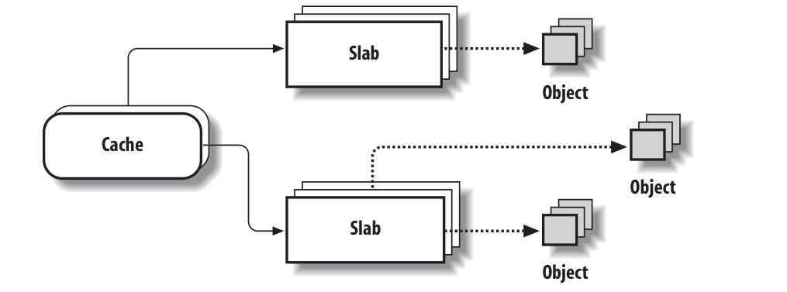
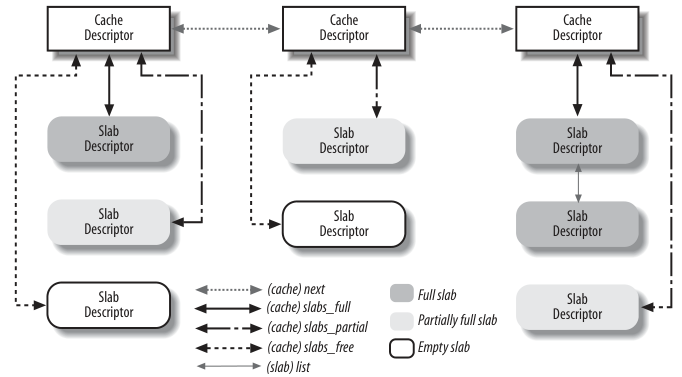
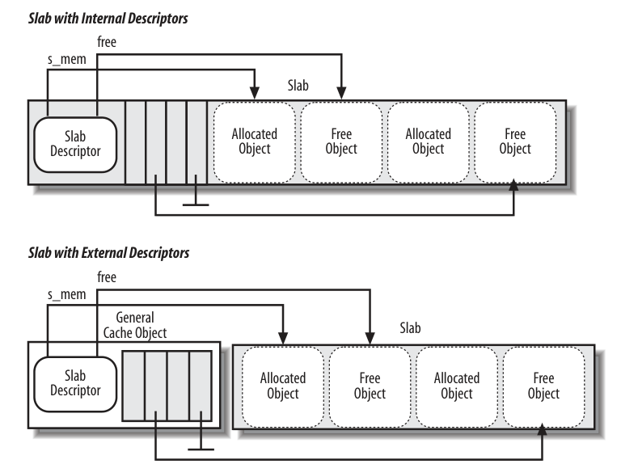

# slab分配器
## 1. 前言

本节关注内存区管理，也就是说，关注**具有连续内存地址或任意长度的内存单元序列**

在使用伙伴系统的场景下，如果为了存放很少的字节（比如`malloc(32)`），而分配一整个页框，很显然，这一种很大的浪费。而新的方法则是引入一种新的数据结构来描述如何在同一页框中分配小的内存区域。但这样也引出了一个新的问题，即内存碎片。内存碎片的产生的原因主要是因为**申请的内存**和**分配的内存**不匹配造成的。

## 2. slab分配器
在伙伴系统算法之上运行内存区域分配算法并不是很有效。在sun公司的Solaris 2.4才做系统上首次采用的slab分配器模式派生出了一种更好的算法。它基于以下前提：
- 存储的数据类型可能会影响内存区域的分配方式。比如，当为用户态下的进程分配页框，内核会调用`get_zeroed_page()`函数，将页框初始化为0.slab分配器扩展了这个想法，将内存区域视作由数据结构和一组构造函数和析构函数组成的对象。
    为了避免重复的初始化对象，slab分配器不会丢弃已经分配然后释放的对象，而是将他们保存在内存中。当以后又要请求新的对象时，就可以从内存中获取而不用重新初始化。
- 内核函数倾向于反复请求相同类型的内存区域。比如内核创建一个进程，就要为一些固定大小的表（比如进程描述符，打开的文件对象等）分配内存。当进程被销毁，可以重用这些表包含的内存区域。因为进程的创建和销毁非常的频繁。如果没有slab分配器，内核会浪费时间重复分配和释放包含相同内存区域的页帧;slab分配器允许将它们保存在缓存中并快速重用

    slab分配器将对象分组放到缓存中，每个缓存存储相同类型的对象。例如，当一个文件被打开，存放相应的"打开文件"所需的内存区，是从一个名字叫`file`（文件指针）的slab高速缓存得到的
    包含主存中包含缓存的区域被划分为多个slab，每个slab包含一个或者多个连续页框。这些页框包含已被分配的和空闲的对象
    

## 3. 相关数据结构

### 3.1 数据结构的整体关系

slab描述符可能存在以下两种地方：
- 外部slab描述符
  - 存放在slab外部，位于cache_sizes指向的一个不适合`ISA DMA`的普通高速缓存中
- 内部slab描述符
  - 存放在slab内部，位于分配给slab的第一个页框的起始位置




### 3.2 每cpu缓存
```c
/* 每cpu数据 */
struct array_cache {
	/* 当前可用的对象数量 */
	unsigned int avail;
	unsigned int limit;
	unsigned int batchcount;
	/* 在从缓存中移除一个对象时，touched = 1，else touched = 0 */
	unsigned int touched;
	spinlock_t lock;
	/* 对象数组 */
	void *entry[];	
};
```
### 3.3 缓存描述符
```c
struct kmem_cache {
/* 1) per-cpu data, touched during every alloc/free */
	struct array_cache *array[NR_CPUS];

/* 2) Cache tunables. Protected by cache_chain_mutex */
	/* batchcount指定了在per-CPU列表为空的情况下，从缓存的slab中获取对象的数目。它还表示在缓存增长缩减时变化的对象数目。 */
	unsigned int batchcount;  
	/* limit指定了per-CPU列表中保存的对象的最大数目。如果超出该值，内核会将batchcount个对象返回到slab（如果接下来内核缩减缓存，则释放的内存从slab返回到伙伴系统）。 */
	unsigned int limit;
	unsigned int shared;
	/* 指定了缓存中管理的对象的大小 */
	unsigned int buffer_size;
	/* 对象大小的倒数，用于计算对象地址 */
	u32 reciprocal_buffer_size;

/* 3) touched by every alloc & free from the backend */
	/* flags是一个标志寄存器，定义缓存的全局性质。当前只有一个标志位。如果管理结构存储在slab外部，则置位CFLGS_OFF_SLAB */
	unsigned int flags;		/* constant flags */
	/* 每个slab中对象的最大数量 */
	unsigned int num;		

/* 4) cache_grow/shrink */
	/* 指定了slab包含的页数的对数 */
	unsigned int gfporder;

	/* 获取页框的标志 */
	gfp_t gfpflags;

	/* 3个colour成员包含了slab着色相关的所有数据 */
	size_t colour;
	unsigned int colour_off;	

	/* 如果slab头部的管理数据存储在slab外部，则slabp_cache指向分配所需内存的一般性缓存。如果slab头部在slab上，则slabp_cache为NULL指针。*/
	struct kmem_cache *slabp_cache;

	/* 每个slab的大小 */
	unsigned int slab_size;
	unsigned int dflags;		

	/* 创建对象的构造函数 */
	void (*ctor)(struct kmem_cache *, void *);

/* 5) cache creation/removal */
	const char *name;
	/* 缓存链表节点 */
	struct list_head next;
	/*  nodelists是一个数组，每个数组项对应于系统中一个可能的内存结点。每个数组项都包含struct kmem_list3的一个实例，该结构中有3个slab列表（完全用尽、空闲、部分空闲），在下文讨论。 */
	struct kmem_list3 *nodelists[MAX_NUMNODES];

};
```

### 3.4 slab描述符
```c
/* 高速缓存中的所有的slab */
struct kmem_list3 {
	struct list_head slabs_partial;	/* 没有被充满的slab对象链表 */
	struct list_head slabs_full;    /* 不包含空闲对象的slab链表 */
	struct list_head slabs_free;    /* 只包含空闲对象的slab链表 */
	unsigned long free_objects;     /* 空闲object的数量 */
	unsigned int free_limit;        /* 空闲object的数量限制 */
	unsigned int colour_next;		/* 各节点缓存着色 */
	spinlock_t list_lock;
	struct array_cache *shared;		/* 结点内共享 */
	struct array_cache **alien;		/* 在其他结点上 */
	unsigned long next_reap;		/* 无需锁定即可更新 */
	/*  
		表示缓存是否是活动的，在从缓存中移除一个对象时，touched = 1，else touched = 0 
		但内核只有在free_touched预先设置为0时，才会收缩缓存。因为1表示内核的另一部分刚从该缓存获取对象，此时收缩是不合适的。
		该变量将应用到整个缓存，因而不同于per-CPU变量touched
	*/
	int free_touched;				/* 无需锁定即可更新 */
};	


/* slab描述符 */
struct slab {
	struct list_head	list;   /* 连接slab描述符的链表 */ 
	unsigned long		colouroff;  /* slab中第一个对象的偏移 */
	void			*s_mem;		/* including colour offset slab中第一个对象的地址，包含了colouroff  */
	unsigned int		inuse;		/* num of objs active in slab 非空闲对象数量*/
	kmem_bufctl_t free;   /* slab的下一个空闲对象的下标 */
	unsigned short nodeid; /* 用于寻址在高速缓存中kmem_list3的下标 */
};
```


## 初始化

## 创建缓存

```c
struct kmem_cache *
kmem_cache_create (const char *name, size_t size, size_t align,
	unsigned long flags,
	void (*ctor)(struct kmem_cache *, void *))
{
	size_t left_over, slab_size, ralign;
	struct kmem_cache *cachep = NULL, *pc;

	/*
	 * Sanity checks... these are all serious usage bugs.
	 */
	if (!name || in_interrupt() || (size < BYTES_PER_WORD) ||
	    size > KMALLOC_MAX_SIZE) {
		printk(KERN_ERR "%s: Early error in slab %s\n", __FUNCTION__,
				name);
		BUG();
	}

	mutex_lock(&cache_chain_mutex);
	BUG_ON(flags & ~CREATE_MASK);

	/*
		将大小向上舍入到处理器字长的倍数
	*/
	if (size & (BYTES_PER_WORD - 1)) {
		size += (BYTES_PER_WORD - 1);
		size &= ~(BYTES_PER_WORD - 1);
	}

	/* 计算缓冲区对象对齐: */

	/* 1) 根据硬件缓存行对齐 */
	if (flags & SLAB_HWCACHE_ALIGN) {

		/* 获取硬件缓存行 */
		ralign = cache_line_size();
		/* 如果对象足够小，就尽量将对象挤满同一缓存行 */
		while (size <= ralign / 2)
			ralign /= 2;
	} else {
		// 体系结构强制对齐
		ralign = BYTES_PER_WORD;
	}

	/*
	 * Redzoning and user store require word alignment or possibly larger.
	   Note this will be overridden by architecture or caller mandated
	   alignment if either is greater than BYTES_PER_WORD.
	 */
	if (flags & SLAB_STORE_USER)
		ralign = BYTES_PER_WORD;

	if (flags & SLAB_RED_ZONE) {
		ralign = REDZONE_ALIGN;
		/* 向上对齐 */
		size += REDZONE_ALIGN - 1;
		size &= ~(REDZONE_ALIGN - 1);
	}

	/* 2) 体系结构强制最小对齐 */
	if (ralign < ARCH_SLAB_MINALIGN) {
		ralign = ARCH_SLAB_MINALIGN;
	}
	/* 3) 用户对齐 */
	if (ralign < align) {
		ralign = align;
	}
	/* disable debug if necessary */
	if (ralign > __alignof__(unsigned long long))
		flags &= ~(SLAB_RED_ZONE | SLAB_STORE_USER);
	/*
	 * 4) 存储最后计算出的对齐值
	 */
	align = ralign;

	/*从cache_cache缓存中分配一个kmem_cache新实例*/
	cachep = kmem_cache_zalloc(&cache_cache, GFP_KERNEL);
	if (!cachep)
		goto oops;


	/* 确定slab描述符的存储位置，如果对象长度大于页帧的1/8，则将头部管理数据存储在slab之外，否则存储在slab上 */
	if ((size >= (PAGE_SIZE >> 3)) && !slab_early_init)
		/*
		 * Size is large, assume best to place the slab management obj
		 * off-slab (should allow better packing of objs).
		 */
		flags |= CFLGS_OFF_SLAB;

	/* 将size与计算出的对齐值对齐 */
	size = ALIGN(size, align);

	/* 计算出slab的大小 size：对象的大小
		left_over 用于着色
	*/
	left_over = calculate_slab_order(cachep, size, align, flags);

	/* num 计算出的slab中对象的数量的大小 */
	if (!cachep->num) {
		printk(KERN_ERR
		       "kmem_cache_create: couldn't create cache %s.\n", name);
		kmem_cache_free(&cache_cache, cachep);
		cachep = NULL;
		goto oops;
	}
	/* 将slab头大小对齐 对象的数目x对象描述符的大小+slab描述符 */
	slab_size = ALIGN(cachep->num * sizeof(kmem_bufctl_t)
			  + sizeof(struct slab), align);

	/* 如果有足够的空间 left_over >= slab_size，就将slab头放入slab上 
		将CFLGS_OFF_SLAB标志位置0
	*/
	if (flags & CFLGS_OFF_SLAB && left_over >= slab_size) {
		flags &= ~CFLGS_OFF_SLAB;
		left_over -= slab_size;
	}

	if (flags & CFLGS_OFF_SLAB) {
		slab_size =
		    cachep->num * sizeof(kmem_bufctl_t) + sizeof(struct slab);
	}

	/* 根据缓存行来计算着色偏移 和设置着色*/
	cachep->colour_off = cache_line_size();
	/* Offset must be a multiple of the alignment. */
	if (cachep->colour_off < align)
		cachep->colour_off = align;
	cachep->colour = left_over / cachep->colour_off;  //计算出颜色的值
	cachep->slab_size = slab_size;
	cachep->flags = flags;
	cachep->gfpflags = 0;  // 分配页框的标志
	if (CONFIG_ZONE_DMA_FLAG && (flags & SLAB_CACHE_DMA))
		cachep->gfpflags |= GFP_DMA;
	cachep->buffer_size = size;
	cachep->reciprocal_buffer_size = reciprocal_value(size);

	/* slab头在外部， 则找个合适的缓存指向slabp_cache */
	if (flags & CFLGS_OFF_SLAB) {
		cachep->slabp_cache = kmem_find_general_cachep(slab_size, 0u);
	
		BUG_ON(ZERO_OR_NULL_PTR(cachep->slabp_cache));
	}

	// 设置构造函数和名字
	cachep->ctor = ctor;
	cachep->name = name;

	//设置per-cpu缓存
	if (setup_cpu_cache(cachep)) {
		__kmem_cache_destroy(cachep);
		cachep = NULL;
		goto oops;
	}

	/* 将缓存添加到缓存链表中中 */
	list_add(&cachep->next, &cache_chain);
oops:
	if (!cachep && (flags & SLAB_PANIC))
		panic("kmem_cache_create(): failed to create slab `%s'\n",
		      name);
	mutex_unlock(&cache_chain_mutex);
	return cachep;
}
EXPORT_SYMBOL(kmem_cache_create);
```

## 分配对象与释放对象
### 1. 分配对象
```c
/* 分配对象可用使用kmalloc 和  kmem_cache_alloc 两种函数*/
/* kmalloc 在后面有提到 */

void *kmem_cache_alloc(struct kmem_cache *cachep, gfp_t flags)
{
	return __cache_alloc(cachep, flags, __builtin_return_address(0));
}

static __always_inline void *
__cache_alloc(struct kmem_cache *cachep, gfp_t flags, void *caller)
{
	unsigned long save_flags;
	void *objp;

	/* 首先尝试从per-CPU缓存分配对象，对于per-CPU缓存分配只需要防止分配被中断 */
	local_irq_save(save_flags);

	/* 前端函数 */
	objp = __do_cache_alloc(cachep, flags);
	local_irq_restore(save_flags);


	// 将对象空间置0
	if (unlikely((flags & __GFP_ZERO) && objp))
		memset(objp, 0, obj_size(cachep));

	return objp;
}

static __always_inline void *
__do_cache_alloc(struct kmem_cache *cachep, gfp_t flags)
{
	return ____cache_alloc(cachep, flags);
}

static inline void *____cache_alloc(struct kmem_cache *cachep, gfp_t flags)
{
	void *objp;
	struct array_cache *ac;

	check_irq_off();


	/* 尝试从per-CPU缓存获取对象 */
	/*
		通过当前cpuid 获取per-CPU缓存
		展开后 
		cachep->array[smp_processor_id()]
	*/
	ac = cpu_cache_get(cachep);
	if (likely(ac->avail)) { /* 检查是否有可用对象 */
		ac->touched = 1;
		objp = ac->entry[--ac->avail];
	} else {
		/* 
			从per-CPU缓存获取失败，从缓存获取对象填充 per-CPU缓存
			在最坏的情况下，可能需要创建新的slab
		*/ 
		objp = cache_alloc_refill(cachep, flags);
	}
	return objp;
}

/* 填充per-CPU缓存 */
static void *cache_alloc_refill(struct kmem_cache *cachep, gfp_t flags)
{
	int batchcount;
	struct kmem_list3 *l3;
	struct array_cache *ac;
	int node;

	node = numa_node_id();

	check_irq_off();

	/* 获取当前cpu的高速缓存 */
	ac = cpu_cache_get(cachep);
retry:
	/* 每次需要填充的对象的数量 */
	batchcount = ac->batchcount;
	if (!ac->touched && batchcount > BATCHREFILL_LIMIT) {
		/* 如果不是经常活动的缓存，则不将对象填充满 */
		batchcount = BATCHREFILL_LIMIT;
	}
	l3 = cachep->nodelists[node];  // 获取当前节点的slab缓存

	/* 对缓存的操作，需要加锁 */ 
	spin_lock(&l3->list_lock);

	/* 尝试从共享数组中填充 */
	if (l3->shared && transfer_objects(ac, l3->shared, batchcount))
		goto alloc_done;

	/*  
		老老实实的从高速缓存中分配 
		这个双城循环会遍历所有的slab，直到per-CPU分配了batchcount个对象
	*/	
	while (batchcount > 0) {
		struct list_head *entry;
		struct slab *slabp;
		/* 先从半满的链表填充 */
		entry = l3->slabs_partial.next;
		/* 如果半满的都空了，则从全空的分配 */
		if (entry == &l3->slabs_partial) {
			l3->free_touched = 1;
			entry = l3->slabs_free.next;
			/* 全空的slab也空了，则必须扩充slab了 */
			if (entry == &l3->slabs_free)
				goto must_grow;
		}

		/* 从可分配的slab链表节点，获取slab（可能是全空或者半空） */
		slabp = list_entry(entry, struct slab, list);

		check_spinlock_acquired(cachep);

		/* 循环从 slab 分配 batchcount个对象给per-CPU缓存*/
		while (slabp->inuse < cachep->num && batchcount--) {
			ac->entry[ac->avail++] = slab_get_obj(cachep, slabp,node);
		}

		/* slab的状态改变，根据对象的情况将slab重新移动到半满或者全满节点中 */
		list_del(&slabp->list);
		if (slabp->free == BUFCTL_END)
			list_add(&slabp->list, &l3->slabs_full);
		else
			list_add(&slabp->list, &l3->slabs_partial);
	}

must_grow:
	/* 已经分配了avail个对象， kmem_list3也要更新相应的变量*/
	l3->free_objects -= ac->avail;
alloc_done:
	spin_unlock(&l3->list_lock);

	/* 如果cpu缓存为空，给缓存填充 */
	if (unlikely(!ac->avail)) {
		int x;
		/* cache_grow 在下一节讲到 功能时增加缓存中的cache*/
		x = cache_grow(cachep, flags | GFP_THISNODE, node, NULL);

		/* cache_grow can reenable interrupts, then ac could change. */
		ac = cpu_cache_get(cachep);
		if (!x && ac->avail == 0)	/* no objects in sight? abort */
			return NULL;

		if (!ac->avail)		/* objects refilled by interrupt? */
			goto retry;
	}
	ac->touched = 1;
	return ac->entry[--ac->avail];
}

static void *slab_get_obj(struct kmem_cache *cachep, struct slab *slabp,
				int nodeid)
{
	/*  static inline void *index_to_obj(struct kmem_cache *cache, struct slab *slab,
				 unsigned int idx)
		{
			return slab->s_mem + cache->buffer_size * idx;
		}
 	*/
	/* 从slab的 free成员找到对象的指针 */
	void *objp = index_to_obj(cachep, slabp, slabp->free);
	
	kmem_bufctl_t next;
	slabp->inuse++; 

	/*获得slab_bufctl[slab->free]的值，为下一次锁定的空闲下标 */
	/*
	static inline kmem_bufctl_t *slab_bufctl(struct slab *slabp)
	{
		return (kmem_bufctl_t *) (slabp + 1);
	}
	*/
	next = slab_bufctl(slabp)[slabp->free];
	/* 将锁定下标放到free中 */
	slabp->free = next;

	return objp;
}
```
### 2. 释放对象
```c
void kmem_cache_free(struct kmem_cache *cachep, void *objp)
{
	local_irq_save(flags);
	__cache_free(cachep, objp);
	local_irq_restore(flags);
}

static inline void __cache_free(struct kmem_cache *cachep, void *objp)
{
	struct array_cache *ac = cpu_cache_get(cachep);


	/* 检查per-CPU是否有可用空间，如果有就加入到per-CPU缓存 */
	if (likely(ac->avail < ac->limit)) {
		ac->entry[ac->avail++] = objp;
		return;
	} else {
		/* 否则就 将部分per-CPU 对象加入到slab */
		cache_flusharray(cachep, ac);
		ac->entry[ac->avail++] = objp;
	}
}

/* 将部分cpu高速缓存flush到slub中 */
static void cache_flusharray(struct kmem_cache *cachep, struct array_cache *ac)
{
	int batchcount;
	struct kmem_list3 *l3;
	int node = numa_node_id();

	/* 指定flush的数量 */
	batchcount = ac->batchcount;

	check_irq_off();
	l3 = cachep->nodelists[node];
	spin_lock(&l3->list_lock);
	/* 如果cpu共享缓存存在，则将共享缓存填满，然后返回 */
	if (l3->shared) {
		struct array_cache *shared_array = l3->shared;
		int max = shared_array->limit - shared_array->avail;
		if (max) {
			if (batchcount > max)
				batchcount = max;
			memcpy(&(shared_array->entry[shared_array->avail]),
			       ac->entry, sizeof(void *) * batchcount);
			shared_array->avail += batchcount;
			goto free_done;
		}
	}
	/* 再释放到slab内 */
	free_block(cachep, ac->entry, batchcount, node);

free_done:
	spin_unlock(&l3->list_lock);
	ac->avail -= batchcount;
	memmove(ac->entry, &(ac->entry[batchcount]), sizeof(void *)*ac->avail);
}

static void free_block(struct kmem_cache *cachep, void **objpp, int nr_objects,
		       int node)
{
	int i;
	struct kmem_list3 *l3;

	for (i = 0; i < nr_objects; i++) {
		void *objp = objpp[i];
		struct slab *slabp;

		/* 通过地址找到slab描述符 */
		slabp = virt_to_slab(objp);
		l3 = cachep->nodelists[node];
		list_del(&slabp->list);
		check_spinlock_acquired_node(cachep, node);
		slab_put_obj(cachep, slabp, objp, node);
		l3->free_objects++;
	
		
		if (slabp->inuse == 0) {
			/* 如果slab内都是未分配的对象，则将slab置于 slabs_free */
			/* 如果slab中的对象数超过了缓存对象限制，则释放这个slab */
			if (l3->free_objects > l3->free_limit) {
				l3->free_objects -= cachep->num;

				slab_destroy(cachep, slabp);
			} else {
				list_add(&slabp->list, &l3->slabs_free);
			}
		} else {
			/* 同时包含使用和未使用的对象，将slab添加到 slabs_partial */
			list_add_tail(&slabp->list, &l3->slabs_partial);
		}
	}
}

static void slab_destroy(struct kmem_cache *cachep, struct slab *slabp)
{
	/* 减去着色偏移 */
	void *addr = slabp->s_mem - slabp->colouroff;

	/* 对每个对象调用析构函数 */
	slab_destroy_objs(cachep, slabp);
	if (unlikely(cachep->flags & SLAB_DESTROY_BY_RCU)) {
		struct slab_rcu *slab_rcu;

		slab_rcu = (struct slab_rcu *)slabp;
		slab_rcu->cachep = cachep;
		slab_rcu->addr = addr;
		call_rcu(&slab_rcu->head, kmem_rcu_free);
	} else {
		/* 这里只关注普通的cache。调用 kmem_freepages释放 为slab分配的页框 */
		kmem_freepages(cachep, addr);
		if (OFF_SLAB(cachep))
			kmem_cache_free(cachep->slabp_cache, slabp);
	}
}

static void kmem_freepages(struct kmem_cache *cachep, void *addr)
{
	unsigned long i = (1 << cachep->gfporder);
	struct page *page = virt_to_page(addr);
	const unsigned long nr_freed = i;

	if (cachep->flags & SLAB_RECLAIM_ACCOUNT)
		sub_zone_page_state(page_zone(page),
				NR_SLAB_RECLAIMABLE, nr_freed);
	else
		sub_zone_page_state(page_zone(page),
				NR_SLAB_UNRECLAIMABLE, nr_freed);
	
	/* 依次清除页框中的slab标志 */
	while (i--) {
		__ClearPageSlab(page);
		page++;
	}
	/* 将页框归还到伙伴系统 */
	free_pages((unsigned long)addr, cachep->gfporder);
}
```


## 为slab分配对象

```c
static int cache_grow(struct kmem_cache *cachep,
		gfp_t flags, int nodeid, void *objp)
{
	struct slab *slabp;
	size_t offset;
	gfp_t local_flags;
	struct kmem_list3 *l3;

	local_flags = flags & (GFP_CONSTRAINT_MASK | GFP_RECLAIM_MASK);

	check_irq_off();
	l3 = cachep->nodelists[nodeid];
	spin_lock(&l3->list_lock);

	/* 计算偏移量和下一个颜色 */
	offset = l3->colour_next;
	l3->colour_next++;
	/* 如果到了最大值就归0 */ 
	if (l3->colour_next >= cachep->colour)
		l3->colour_next = 0;

	spin_unlock(&l3->list_lock);

	/* 根据着色计算出偏移 */
	offset *= cachep->colour_off;

	if (local_flags & __GFP_WAIT)
		local_irq_enable();


	/* 从伙伴系统获得物理页 */
	if (!objp)
		objp = kmem_getpages(cachep, local_flags, nodeid);
	if (!objp)
		goto failed;

	/* 则调用此函数 申请 slab 头*/
	slabp = alloc_slabmgmt(cachep, objp, offset,
			local_flags & ~GFP_CONSTRAINT_MASK, nodeid);
	/* 申请失败，释放之前申请的对象 */
	if (!slabp)
		goto opps1;

	// 在kmem_cache中数组的下标
	slabp->nodeid = nodeid;

	/* 依次对每个物理页的lru.next=cache，lru.prev=slab */
	slab_map_pages(cachep, slabp, objp);
	/* 
	static void slab_map_pages(struct kmem_cache *cache, struct slab *slab,
			   void *addr)
	{
		int nr_pages;
		struct page *page;

		page = virt_to_page(addr);

		nr_pages = 1;
		if (likely(!PageCompound(page)))
			nr_pages <<= cache->gfporder;
		do {
			page->lru.prev = (struct list_head *)slab;
			page->lru.next = (struct list_head *)cache;
			page++;
		} while (--nr_pages);
	}

	*/
	

	/* 调用各个对象的构造器函数，初始化新SLAB中的对象 */
	cache_init_objs(cachep, slabp);

	if (local_flags & __GFP_WAIT)
		local_irq_disable();
	check_irq_off();
	spin_lock(&l3->list_lock);

	/* 将新的SLAB加入到全空链表中*/
	list_add_tail(&slabp->list, &(l3->slabs_free));
	/* 新产生的对象的数目也加到缓存中空闲对象的数目上（cachep->free_objects） */
	l3->free_objects += cachep->num;

	spin_unlock(&l3->list_lock);
	return 1;
opps1:
	kmem_freepages(cachep, objp);
failed:
	if (local_flags & __GFP_WAIT)
		local_irq_disable();
	return 0;
}


/* slab与伙伴系统的接口 */
static void *kmem_getpages(struct kmem_cache *cachep, gfp_t flags, int nodeid)
{
	struct page *page;
	int nr_pages;
	int i;

#ifndef CONFIG_MMU
	flags |= __GFP_COMP;
#endif

	flags |= cachep->gfpflags;
	if (cachep->flags & SLAB_RECLAIM_ACCOUNT)
		flags |= __GFP_RECLAIMABLE;
	/* 在伙伴系统分配页框 */
	page = alloc_pages_node(nodeid, flags, cachep->gfporder);
	if (!page)
		return NULL;

	nr_pages = (1 << cachep->gfporder);
	if (cachep->flags & SLAB_RECLAIM_ACCOUNT)
		add_zone_page_state(page_zone(page),
			NR_SLAB_RECLAIMABLE, nr_pages);
	else
		add_zone_page_state(page_zone(page),
			NR_SLAB_UNRECLAIMABLE, nr_pages);

	/* 为每个页框设置slab标志 */
	for (i = 0; i < nr_pages; i++)
		__SetPageSlab(page + i);
	return page_address(page);
}
```


## 通用缓存
即`kmalloc`和`kfree`使用的，放在cache_sizes中，从2^5 - 2^25有21个成员。
```c
struct cache_sizes {
	size_t		 	cs_size;  /* 该项负责的内存区大小 */
	struct kmem_cache	*cs_cachep;  /* 高速缓存 */
#ifdef CONFIG_ZONE_DMA
	struct kmem_cache	*cs_dmacachep;  /* DMA访问缓存 */
#endif
};


//通用高速缓存在/kmalloc_sizes.h
struct cache_sizes malloc_sizes[] = {
#define CACHE(x) { .cs_size = (x) },
#include <linux/kmalloc_sizes.h>
	CACHE(ULONG_MAX)
#undef CACHE
};

// kmalloc_sizes.h
#if (PAGE_SIZE == 4096)
	CACHE(32)
#endif
	CACHE(64)
#if L1_CACHE_BYTES < 64
	CACHE(96)
#endif
	CACHE(128)
#if L1_CACHE_BYTES < 128
	CACHE(192)
#endif
	CACHE(256)
	CACHE(512)
	CACHE(1024)
	CACHE(2048)
	CACHE(4096)
	CACHE(8192)
	CACHE(16384)
	CACHE(32768)
	CACHE(65536)
	CACHE(131072)
#ifndef CONFIG_MMU
	CACHE(262144)
	CACHE(524288)
	CACHE(1048576)
#ifdef CONFIG_LARGE_ALLOCS
	CACHE(2097152)
	CACHE(4194304)
	CACHE(8388608)
	CACHE(16777216)
	CACHE(33554432)
#endif /* CONFIG_LARGE_ALLOCS */
#endif /* CONFIG_MMU */

```

kmalloc 与 kfree
```c
static inline void *kmalloc(size_t size, gfp_t flags)
{
	/* size是否是常数 */
	if (__builtin_constant_p(size)) {
		
		/* 使用预设的大小，进行分配，*/
		int i = 0;

		if (!size)
			return ZERO_SIZE_PTR;
#define CACHE(x) \
		if (size <= x) \
			goto found; \
		else \
			i++;
#include "kmalloc_sizes.h"
#undef CACHE
		{
			// 静态缓存用完，报错 提醒内核开发者
			extern void __you_cannot_kmalloc_that_much(void);
			__you_cannot_kmalloc_that_much();
		}
found:
#ifdef CONFIG_ZONE_DMA
		if (flags & GFP_DMA)
			return kmem_cache_alloc(malloc_sizes[i].cs_dmacachep,
						flags);
#endif
		/* 使用预定义的缓存，没有多余检查操作 */
		return kmem_cache_alloc(malloc_sizes[i].cs_cachep, flags);
	}
	/* size 不是常数则调用kamlloc */
	return __kmalloc(size, flags);
}


void *__kmalloc(size_t size, gfp_t flags)
{
	return __do_kmalloc(size, flags, __builtin_return_address(0));
}

static __always_inline void *__do_kmalloc(size_t size, gfp_t flags,
					  void *caller)
{
	struct kmem_cache *cachep;

	/* If you want to save a few bytes .text space: replace
	 * __ with kmem_.
	 * Then kmalloc uses the uninlined functions instead of the inline
	 * functions.
	 */
	 /* 寻找一个合适大小高速缓存 */
	 /* 这些动态size的决策，相较于静态方式的决策比较慢 */
	cachep = __find_general_cachep(size, flags);
	if (unlikely(ZERO_OR_NULL_PTR(cachep)))
		return cachep;
	/* 开始分配 */
	return __cache_alloc(cachep, flags, caller);
}

static inline struct kmem_cache *__find_general_cachep(size_t size,
							gfp_t gfpflags)
{
	struct cache_sizes *csizep = malloc_sizes;
	if (!size)
		return ZERO_SIZE_PTR;
	while (size > csizep->cs_size)
		csizep++;
#ifdef CONFIG_ZONE_DMA
	if (unlikely(gfpflags & GFP_DMA))
		return csizep->cs_dmacachep;
#endif
	return csizep->cs_cachep;
}

void kfree(const void *objp)
{
	struct kmem_cache *c;
	unsigned long flags;

	if (unlikely(ZERO_OR_NULL_PTR(objp)))
		return;
	local_irq_save(flags);
	kfree_debugcheck(objp);
	c = virt_to_cache(objp);
	debug_check_no_locks_freed(objp, obj_size(c));
	/* 在找到与内存指针关联的缓存之后，kfree将实际工作移交上文讨论过的__cache_free函数完成。 */
	__cache_free(c, (void *)objp);
	local_irq_restore(flags);
}

void kfree(const void *objp)
{
	struct kmem_cache *c;
	unsigned long flags;

	if (unlikely(ZERO_OR_NULL_PTR(objp)))
		return;
	local_irq_save(flags);
	kfree_debugcheck(objp);
	c = virt_to_cache(objp);
	debug_check_no_locks_freed(objp, obj_size(c));
	/* 在找到与内存指针关联的缓存之后，kfree将实际工作移交上文讨论过的__cache_free函数完成。 */
	__cache_free(c, (void *)objp);
	local_irq_restore(flags);
}

```