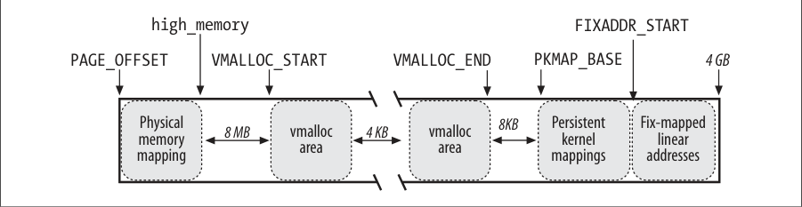

# 非连续内存管理

从前面的章节我们知道，把内存映射待一组连续的页框是最好的选择，这样会充分利用高速缓存并获得较低的平均访问时间。不过，如果对内存区的请求不是很频繁，那么，通过连续的线性地址来访问非连续的页框这样的一种分配方式就会显得很有意义。
这种模式主要是避免了外碎片，而缺点是打乱了内核页表。显然，非连续内存区的大小必须是4096的倍数。Linux在几个地方使用非连续内存区，例如，为活动的交换区分配数据结构，为模块分配空间（linux驱动模块），或者给某些I/O驱动程序分配缓存。

## 非连续内存区的线性地址

见 [高端内存映射的顺序](01_Linux页框管理（一）.md#L145)

在物理内存映射的末尾与第一个内存之间差入一个大小为8MB的安全区，目的是为了捕获内存的越界访问。出于同样的理由，插入其他4kb大小的安全区来隔离非连续的内存区。



## 非连续内存区的描述符

|类型|名称|说明|
|--|--|--|
|void*|addr|内存区内第一个内存单元的线性地址|
|unsigned long|size|内存区的大小 + 4096（内存区之间的安全区间的大小）|
|unsigned long|flag|非连续内存映射的内存的类型|
|strutc page**|pages|指向 nr_pages数组的指针，该数组由指向页描述符的指针组成|
|unsugned int|nr_pages|内存区填充的页框个数|
|unsugned long|phys_addr|该字段设为0，除非内存已被创建来映射一个硬件的I/O共享设备|
|struct vm_struct*|next|指向下一个vm_struct结构的指针|

```c
struct vm_struct {
	void			*addr;
	unsigned long		size;
	unsigned long		flags;
	struct page		**pages;
	unsigned int		nr_pages;
	unsigned long		phys_addr;
	struct vm_struct	*next;
};
```

通过`next`字段，这些描述符被插入到一个简单的链表中，链表的第一个元素的地址存放在vm_list变量中。flags字段标识了非连续区映射的内存的类型：`VM_ALLOC`表示使用`vmalloc()`申请得到的页，`VM_MAP`表示使用`vmap()`映射的已分配的页，而`VM_IOREMAP`表示使用`ioremap()`映射的硬件设备版的版上内存。

`get_vm_area()`函数在线性地址`VMALLOC_START`到`VMALLOC_END`之间查找一个空闲区域。
函数原型
```c
struct vm_struct *get_vm_area(unsigned long size, unsigned long flags);
```
执行步骤如下
1. 调用`kmalloc()`获得一个`vm_struct`类型的内存区描述符。`kmalloc`从`slab`分配内存。
2. 为写得到`vmlist_lock`锁, 并扫描类型为`vm_struct`的描述符表来查找空闲的线性地址，空闲线性地址大小至少为`size + 4096`
3. 如果存在这样的空间，函数就**初始化描述符的字段**，释放`vmlist_lock`锁，并以返回这个非连续内存区的其实地址而结束。
   初始化描述符包括**addr，size，flag**
4. 否则，get_vm_area()释放先前得到的描述符，释放vmlist_lock，然后返回NULL。

## 分配非连续内存区

vmalloc() 函数给内核分配一个非连续的内存区。
```c
void *vmalloc(unsigned long size)
{
       return __vmalloc(size, GFP_KERNEL | __GFP_HIGHMEM, PAGE_KERNEL);
}
void *__vmalloc(unsigned long size, int gfp_mask, pgprot_t prot)
{
	struct vm_struct *area;
	struct page **pages;
	unsigned int nr_pages, array_size, i;

    /* 将size拓展为4096的整数倍 */
	size = PAGE_ALIGN(size); 
	if (!size || (size >> PAGE_SHIFT) > num_physpages)
		return NULL;

    /* 创建一个新的描述符 描述符的flag字段被初始化为 VM_ALLOC */
	area = get_vm_area(size, VM_ALLOC);
	if (!area)
		return NULL;

    /* 计算出 page 计数 */
	nr_pages = size >> PAGE_SHIFT;
	array_size = (nr_pages * sizeof(struct page *));

	area->nr_pages = nr_pages;
	/* Please note that the recursion is strictly bounded. */
	if (array_size > PAGE_SIZE)
		pages = __vmalloc(array_size, gfp_mask, PAGE_KERNEL);
	else
        /* __vmalloc 调用kmalloc为pages字段分配内存 */
		pages = kmalloc(array_size, (gfp_mask & ~__GFP_HIGHMEM));
	area->pages = pages;

    /* 若分配失败，则清除内存区描述符，并返回NULL */
	if (!area->pages) {
		remove_vm_area(area->addr);
		kfree(area);
		return NULL;
	}

    /* 将pages页描述符数组指针初始化为 0 */
	memset(area->pages, 0, array_size);

    /* 使用alloc_page 函数逐个申请页框 页框很可能不是连续的*/
	for (i = 0; i < area->nr_pages; i++) {
		area->pages[i] = alloc_page(gfp_mask);
		if (unlikely(!area->pages[i])) {
			/* Successfully allocated i pages, free them in __vunmap() */
			area->nr_pages = i;
			goto fail;
		}
	}
	
    /* 现在已经分配了一组非连续的页框来映射这些线性地址，最后至关重要的是修改内核使用的页表项
    以此表明分配给非连续内存区的每个页框对应着一个线性地址 */
	if (map_vm_area(area, prot, &pages))
		goto fail;
	return area->addr;

fail:
	vfree(area->addr);
	return NULL;
}
```

`map_vm_area`函数将非连续页框映射到连续页框上
函数定义在[mm/vmalloc.c line201](https://elixir.bootlin.com/linux/v2.6.11/source/mm/vmalloc.c#L201)
```c
/* 参数
*  area：vm_struct 描述符的指针   
*  prot：已分配页框的保护位。在vmalloc中始终为 PAGE_KERNEL
*  pages：struct page* 数组的指针，
*/
int map_vm_area(struct vm_struct *area, pgprot_t prot, struct page ***pages)
{
    /*
     * 先将非连续内存区的开始和末尾分别赋值给 address end
     */
	unsigned long address = (unsigned long) area->addr;
	unsigned long end = address + (area->size-PAGE_SIZE);
	unsigned long next;
	pgd_t *pgd;
	int err = 0;
	int i;

    /*
      linux 2.6使用 4级页表
      PGD --> PUD --> PMD --> PT
        |       |       |      |
        |       |       |      +--> 实际物理页面 (pages)
        |       |       +------> 中间目录
        |       +------------> 上级目录
        +------------------> 全局目录
        
    pgd_offset_k 用于获取pgd条目得指针
    pgd_index 用于获取pgd条目得索引
    类似于数组的下标和指针关系
    */
    /* 获取address所在的全局页目录表起始条目 */
	pgd = pgd_offset_k(address);
	
    // 获取页表自旋锁，避免竞争条件
    spin_lock(&init_mm.page_table_lock);

    /*从起始条目开始遍历，直到所有得页框都被映射*/
	for (i = pgd_index(address); i <= pgd_index(end-1); i++) {
        // 新建以一个条目，用来存放所有的page，起始点为address
		pud_t *pud = pud_alloc(&init_mm, pgd, address);
		if (!pud) {
			err = -ENOMEM;
			break;
		}

        // 计算线性地址的所在的下一个全局页目录项的起始地址
		next = (address + PGDIR_SIZE) & PGDIR_MASK;
        // 如果下一个起始地址 超出了当表项范围，说明在当前表项可以映射所有的物理内存
		if (next < address || next > end)
			next = end;

        // 然后向下依次添加更第一记的条目
		if (map_area_pud(pud, address, next, prot, pages)) {
			err = -ENOMEM;
			break;
		}

        /*****************************************************************************************************************
        上层目录映射
        The map_area_pud( ) function executes a similar cycle for all the page tables that a Page Upper Directory points to:
        */
        do {
        pmd_t * pmd = pmd_alloc(&init_mm, pud, address);
        if (!pmd)
        return -ENOMEM;
        if (map_area_pmd(pmd, address, end-address, prot, pages))
        return -ENOMEM;
        address = (address + PUD_SIZE) & PUD_MASK;
        pud++;
        } while (address < end);
        /* 中间目录映射
        The map_area_pmd( ) function executes a similar cycle for all the Page Tables that a Page Middle Directory points to:
        */
        do {
        /* 分配一个新的页表 */
        pte_t * pte = pte_alloc_kernel(&init_mm, pmd, address);
        if (!pte)
        return -ENOMEM;
        if (map_area_pte(pte, address, end-address, prot, pages))
        return -ENOMEM;
        address = (address + PMD_SIZE) & PMD_MASK;
        pmd++;
        } while (address < end);

        /* 页框映射
        The main cycle of map_area_pte( ) is:
        */
        do {
        struct page * page = **pages;
        // 将物理页的内容以及已分配页框的保护位 填入该页表实现映射
        set_pte(pte, mk_pte(page, prot));
        address += PAGE_SIZE;
        pte++;
        (*pages)++;
        } while (address < end);
        /****************************************************************************************************************/

		address = next;
		pgd++;
	}

    /* 物理页映射完成，释放锁 并刷新缓存*/
	spin_unlock(&init_mm.page_table_lock);
	flush_cache_vmap((unsigned long) area->addr, end);
	return err;
}
```
除了`vmalloc()`函数外，非来纳许内存区还能由`vmalloc_32()`函数分配，但是它只从`ZONE_NORMAL`和`ZONE_DMA`内存管理区中分配页框

Linux2.6还特别提供了一个vmap函数与vmalloc很相似，**但是他不分配页框**。完成的工作是，在vmalloc虚拟地址空间中找到一个空闲区域，然后将page页面数组对应的物理内存映射到该区域，最终返回映射的虚拟起始地址。

## 释放非连续内存区

`vfree()`函数释放`vmalloc()`或者`vmalloc_32()`创建的非连续内存区，而`vunmap()`函数释放`vmap()`创建的内存区。两个函数都是用同一个参数————将要释放的内存区的线性地址`address`，他们都依赖于`__vunmap()`函数来做实质上的工作。该函数执行以下操作：
1. 调用`remove_vm_area()`函数得到`vm_struct`描述符的地址`area`，并清除非连续内存区中的线性地址对应的内核的页表项
2. 如果`deallocate`被置位，函数扫描指向页描述符的`area->pages`指针数组，对于数组的每一个元素，调用`__free_page()`函数释放页框到分区页框分配器。此外，执行`kfree(area->pages)`来释放数组本身。
3. 调用`kfree(area)`来释放`vm_struct`描述符。


```c
/*  vfree 和 vunmap 通过置位__vunmap函数的deallocate_pages的值来决定是否释放pages中的页框，
	当然一般是 vmalloc vfree，vmap vunmap成对使用
*/
void vfree(void *addr)
{
	BUG_ON(in_interrupt());
	__vunmap(addr, 1);
}
void vunmap(void *addr)
{
	BUG_ON(in_interrupt());
	__vunmap(addr, 0);
}


void __vunmap(void *addr, int deallocate_pages)
{
	struct vm_struct *area;

	if (!addr)
		return;
	
	// 检查 address是否页对齐
	if ((PAGE_SIZE-1) & (unsigned long)addr) {
		printk(KERN_ERR "Trying to vfree() bad address (%p)\n", addr);
		WARN_ON(1);
		return;
	}

	// 从全局内核页表目录开始，逐级取消映射
	area = remove_vm_area(addr);
	if (unlikely(!area)) {
		printk(KERN_ERR "Trying to vfree() nonexistent vm area (%p)\n",
				addr);
		WARN_ON(1);
		return;
	}
	// 根据传入的标志决定是否释放页框，vfree释放，vunmap不释放页框
	if (deallocate_pages) {
		int i;

		// 释放归还页框
		for (i = 0; i < area->nr_pages; i++) {
			if (unlikely(!area->pages[i]))
				BUG();
			__free_page(area->pages[i]);
		}

		// 然后再释放为页框描述符申请的页框描述符数组
		if (area->nr_pages > PAGE_SIZE/sizeof(struct page *))
			vfree(area->pages);
		else
			kfree(area->pages);
	}

	kfree(area);
	return;
}

```c
struct vm_struct *remove_vm_area(void *addr)
{
	struct vm_struct **p, *tmp;

	write_lock(&vmlist_lock);
	// 遍历 vmlist链表，找到要移除的非连续内存区
	for (p = &vmlist ; (tmp = *p) != NULL ;p = &tmp->next) {
		 if (tmp->addr == addr)
			 goto found;
	}
	write_unlock(&vmlist_lock);
	return NULL;

found:
	unmap_vm_area(tmp);
	*p = tmp->next;
	write_unlock(&vmlist_lock);
	return tmp;
}
```
