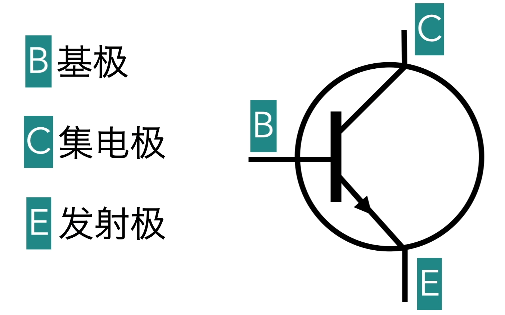

# 51单片机 ( 以STC89C52RC为例 )

## 51单片机简介

51单片机是一种8位单片机，由Intel公司于1980年代初开发，是当时世界上最小、最便宜的单片机。51单片机的内部结构和8086微处理器相似，但是51单片机的指令集比8086微处理器要简单得多，因此51单片机的学习门槛比较低，是入门单片机的好选择。

## C51中的额外标识符与关键字

|    关键字    |        用途        |                 说明                  |
| :----------: | :----------------: | :-----------------------------------: |
|    \_at\_    |      地址定位      |       为位变量进行绝对地址定位        |
| \_priority\_ |   多任务优先说明   | 规定 RTX51 或 RTX51 Tiny 的任务优先级 |
|   \_task\_   |      任务声明      |          定义实时多任务函数           |
|    alien     |    函数特征声明    |     用于声明与 PL/M51 兼容的函数      |
|    bdata     |   存储器类型声明   |   可位寻址的 MCS-51 内部数据寄存器    |
|     bit      |     位变量声明     |      声明一个位变量或位类型函数       |
|     code     |   存储器类型声明   |         MCS-51的程序存储空间          |
|   compact    |     存储器模式     |    按compact模式分配变量的存储空间    |
|     data     |   存储器类型声明   |    直接寻址 MCS-51的内部数据寄存器    |
|    idata     |   存储器类型声明   |    间接寻址 MCS-51的内部数据寄存器    |
|  interrupt   |    中断函数声明    |         定义一个中断服务函数          |
|    large     |     存储器模式     |     按large模式分配变量的存储空间     |
|    pdata     |   存储器类型声明   |      分页寻址的MCS-5外部数据空间      |
|     sbit     |     位变量声明     |            声明一个位变量             |
|     srf      | 特殊功能寄存器声明 |       声明一个8位特殊功能寄存器       |
|    srf16     | 特殊功能寄存器声明 |      声明一个16位特殊功能寄存器       |
|    small     |     存储器模式     |    按small 模式分配变量的存储空间     |
|    using     |    寄存器组定义    |        定义MCS-5的工作寄存器组        |
|    xdata     |   存储器类型声明   |         定以MCS-5处部数据空间         |


## 电子元器件

### 三极管

三极管是一种电子元器件，它由三个电极组成，分别是基极（Base）、集电极（Collector）和发射极（Emitter）。三极管的作用是控制电流的流动，它的工作原理是当电流从基极流向集电极时，三极管就会导通，电流就会从集电极流向发射极。三极管的电路图如下：

三极管分两种，有PNP三极管和NPN三极管

如何区分：观察三极管的箭头指向，箭头由P->N


## I/O口

P1口是51单片机的8位I/O口，它的作用是用来连接外部的电路，例如LED灯、按键、数码管等。

## I/O口的使用

51单片机的I/O口有

I/O口的使用分为两种方式：

1. 直接操作I/O口

   例如：P1=0xAA;  //1010 1010 将P1口的0 2 4 6 位都置为低电平
   直接操作的进阶用法：
   使用位移运算符，例如：P1=0xAA<<1; 0101 0100 //将P1口的0 1 3 5 位都置为低电平

2. 通过位操作

   例如：P1.0=0; //将P1口的第0位置为低电平

   使用位操作的好处是可以单独控制I/O口的每一位，


```c
// 使1左移或0左移
// 使1左移
unsigned char i = 0x01;  // 0000 0001
while(1)
{
    P0 = i;
    i << 1;  // 0000 0001 -> 0000 0010 
    delay(100);
    if(i == 0x00)
        i = 0x01;

        
}

//使0左移
// 1
unsigned char i = 0x01;  // 0000 0001
while(1)
{
    P0 = ~i;   // P0 = 1111 1110
    i << 1;  // 0000 0001 -> 0000 0010    ~i = 1111 1101
    delay(100);
    if(i == 0x00)
        i = 0x01;  
}
    
// 2
unsigned char i = 0xFE;   //1111 1110
while(1)
{
    P0 = i;
    i << 1;   // 1111 1110 -> 1111 1100
    i | 0x01;   // 1111 1100 -> 1111 1101  或操作使补0位为1
    delay(100);
    if(i == 0xFF)
        i = 0xFE;
}


```


## flash与ram

### flash

存储程序

单片机 Flash通常是指单片机内部的Flash存储器，用于存储程序代码和相关数据。Flash存储器通常具有非易失性，即使在断电情况下也可以保持存储的数据不丢失。

许多单片机都包含了内部Flash存储器，这些存储器可以通过编程方式进行修改。在使用单片机时，程序员可以将自己编写的代码烧录到Flash存储器中，并在单片机上运行这些代码。另外，一些单片机还提供了额外的可编程存储器（如EEPROM或NVRAM），用于存储需要在程序运行期间进行修改的数据。

### ram

存储变量

单片机（microcontroller）的 RAM（Random Access Memory）是指它内部集成的随机存取存储器，用于存储程序运行时所需要的数据。

单片机的 RAM 分为静态RAM（SRAM）和动态RAM（DRAM）两种。静态RAM 的读写速度较快，但容量较小，通常只有几十KB到几百KB；动态RAM 的容量较大，可以达到几MB甚至更多，但是读写速度比静态RAM 慢一些。

在单片机编程中，RAM 的使用非常重要。程序中定义的变量和数组等数据都需要存储在 RAM 中，在程序执行过程中进行读写操作。因此，程序员需要合理地利用 RAM，避免浪费空间，确保程序能够正常运行。同时，还需要注意 RAM 的读写速度，尽可能地减少对 RAM 的读写操作，提高程序的执行效率。

### program size


在单片机程序中，通常将内存分为三种类型：数据（data）、扩展数据（xdata）和代码（code）。

数据（data）是指用于存储程序运行时使用的变量和数组等数据的内存区域。这些数据通常被声明在程序的全局作用域中，并且会在程序启动时初始化。在一些单片机中，数据内存还可以通过特殊指令和寄存器访问。

扩展数据（xdata）是一个更大的内存区域，用于存储需要更多空间的数据，例如大型数组或缓冲区等。在一些单片机中，这个内存区域需要通过特殊的寻址方式来访问。

代码（code）是程序执行的指令和函数等代码所存储的内存区域。这些代码通常被编译成二进制文件，并存储在单片机的Flash或ROM等非易失性存储器中。程序在运行时会从这个内存区域中取出指令进行执行。

因此，对于单片机程序的大小，我们需要考虑三个方面：数据大小、扩展数据大小和代码大小。而这三个方面的大小又会依赖于具体的单片机架构和编程语言等因素。


可以使用以上关键字指定数据存储位置
```c
unsigned int code i;
// 这句代码会指定i存储到code段中

```


## T0中断

### T0定时器

#### 概念

- T0计时器是一种常见的计时器，通常由一个可编程的计数寄存器和一组控制寄存器组成。它可以被用来生成精确的时间延迟或者周期性的脉冲信号。
- T0计时器通常被用于微控制器等嵌入式设备中，用来进行定时、计数和计时器中断等操作。在使用T0计时器时，需要将所需要延迟或产生的周期数写入到计数寄存器中，并设置好相应的控制寄存器以启动计时器。当计时器计数达到预设值时，它可以触发一个中断或输出一个脉冲信号，从而完成所需的计时或计数操作。
- T0计时器在嵌入式系统中具有广泛的应用，例如实现PWM（脉冲宽度调制）控制、定时采样、计时测量等功能。

#### 定时器涉及的寄存器

- MTOD
  
  TMOD各位功能描述（以定时器0为例）

  |      位       |   符号   |                             功能                             |
  | :-----------: | :------: | :----------------------------------------------------------: |
  |    TMOD.3     |   GATE   | 门控位，用于设置计数器计数与否，是否受INIT0电压状态的影响。GATE＝0时，表示计数器计数与否与中断端口电压状态无关；GATE＝1时，计数器是否计数要参考引脚的状态，即INIT0为高时T0才计数 |
  |    TMOD.2     | C/（~T） | C/T:定时/计数模式选择位。    ＝0为定时模式；   =1为计数模式。 |
  | TMOD.1 TMOD.0 |  M1 M2   |                    定时器/计数器 模式选择                    |
  |               | 0     0  | 13位定时器/计数器，兼容8048定时器模式，TL1只用低5位参与分频，TH1整个8位全用 |
  |               | 0     1  |               16位定时器/计数器，TL1、TH1全用                |
  |               | 1     0  |   8位自动重装载定时器，当溢出时将TH1存放的值自动重装入TL1    |
  |               | 1     1  |              定时器/计数器1此时无效（停止计数）               |

  
- TCON （以定时器0 为例）
    - LT0，HT0：分别为16位计数器的低位与高位
    - TF0：定时器/计数器О溢出标志位。当T0被允许计数后，TO从初值开始加1计数，最高位产生溢出时，置“1”TFO，并向CPU请求中断，当CPU响应时，由硬件清“0”TF0，TFO也可以由程序查询或清“0 ”。
    - TR0：定时器TO的运行控制位。该位由软件置位和清零。当GATE(TMOD.3 ) =0，TRO=1时就允许TO开始计数，TR1=0时禁止TO计数。当GATE (TMOD.3)=1，TRO=1且INT0输入高电平时，才允许T0计数。


#### 计算配置计时时间 

```c
sbit LED = P1 ^ 0;
void main()
{

    unsigned int cnt = 0;
    P1 = 0x55;
    TMOD = 0x01;  // 设置定时器模式 

    TL0 = 0x00;  //设置定时器事件
    TH0 = 0xEE;

    TR0 = 1; // 启动定时器

    while (1)
    {
        if (TF0 == 1)  // 检测定时寄存器是否溢出
        {
            TF0 = 0;    // 再次开始定时
            TL0 = 0x00;
            TH0 = 0xEE;
            cnt++;
            if(cnt >= 50){
            P1 = ~P1;
            cnt = 0;
            }
        }
    }
}
```


### T0中断


### 几种工作模式


 