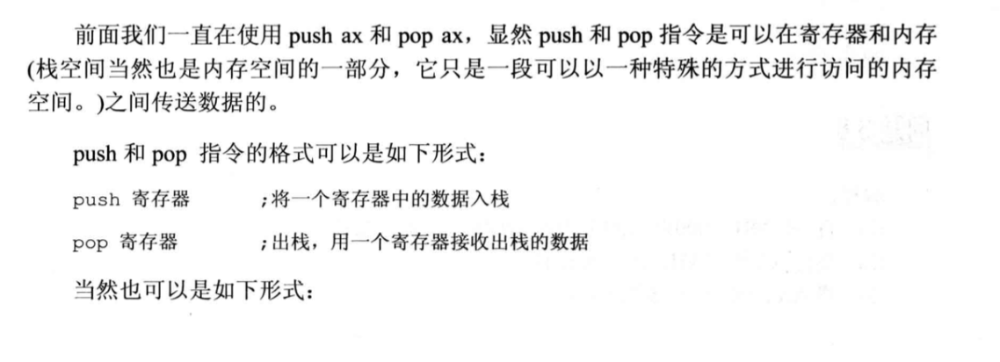
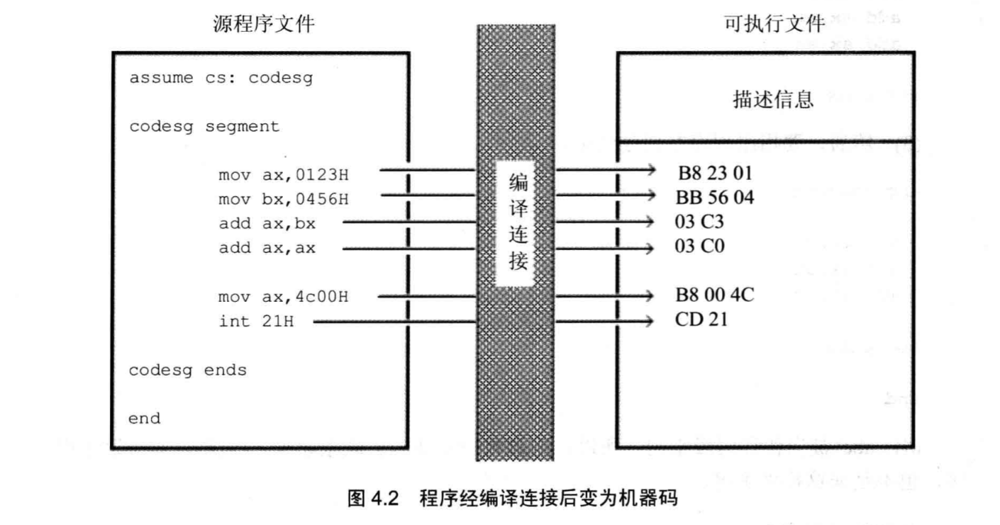
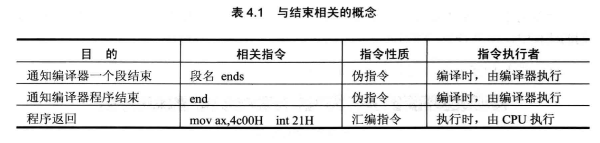

# 8086汇编语言 《王爽》

## 寄存器

> ### 通用寄存器

AX BX CX DX

8086CPU的上一代CPU中的寄存器都是8位的，为了保证兼容，使原来基于上代CPU编写的程序稍加修改就可以运行在8086之上，8086CPU的AX、BX、CX、DX这4个寄存器都可分为两个可独立使用的8位寄存器来用：
- AX可分为 AH，AL 
- BX可分为 BH，BL 
- CX可分为 CH，CL 
- DX可分为 DH，DL 

以AX为例，8086CPU的16位寄存器分为两个8位寄存器


> ### 段寄存器

- CS 代码段寄存器
- DS 数据段寄存器
- SS 栈寄存器
- ES 扩展栈寄存器

立即数无法直接送入段寄存器

CS 和 IP是8086cpu中两个最关键的寄存器。他指示了cpu当前要读取指令的地方。CS为**代码段寄存器**，IP为**指令指针寄存器**

8086CPU 中，有两个奇存器，段寄存器 sS 和寄存器 SP，栈顶的段地址存放在SS 中，偏移地址存放在SP 中。任意时刻，SS:SP 指向栈顶元素。push 指令和 pop 指
令执行时，CPU 从SS 和SP 中得到栈顶的地址


> #### 修改CS IP的指令
在 CPU 中，程序员能够用指令读写的部件只有寄存器，程序员可以通过改变寄存器中的内容实现对 CPU 的控制。CPU 从何处执行指令是由 CS、IP 中的内容决定的，程序
员可以通过改变CS、IP中的内容来控制 CPU 执行目标指令。

可以修改CS，PC的最简单的指令：jmp指令处取指令

若想同时修改CS，IP的内容，可用形如“jmp 段地址:偏移地址”的指令完成。例如
jmp 2AE3:3 执行后：CS=2AE3H IP=3  CPU将从2AE33H开始执行

若想修改IP的内容，可以形如`jmp 某一合法寄存器`的指令完成。例如
mov ax,3H
jmp ax  执行后：IP=3H  CPU将从3H开始执行


> #### 字在寄存器中的存储

- 字节 Byte, 一个字节由8个bit组成,可以存在8位寄存器中
- 字 word, 一个字由两个字节组成，这两个字节分别为这个字的高位字节，与地位字节

一个字既可以看成一个1byte数据类型，也可以看成2个8bit数据类型

SI DI SP BP IP PSW 

> #### 8086cpu给出地址的方法

8086CPU有20位地址总线，可以传送20位地址，达到1MB 寻址能力。8086CPU又是16位结构，在内部一次性处理、传输、暂时存储的地址为 16位。从8086CPU的内部结构来看，如果将地址从内部简单地发出，那么它只能送出16位的地址，表现出的寻址能力只有 64KB。故8086CPU采用一种在内部用两个16位地址合成的方法来形成一个20 位的物理地址。


> #### DS 和 [address]

CPU 要读写一个内存单元的时候，必须先给出这个内存单元的地址，在8086PC 中，内存地址由段地址和偏移地址组成。8086CPU 中有一个 DS 寄存器，通常用来存放要访问数据的段地址。比如我们要读取 10000H 单元的内容，可以用如下的程序段进行。
```
mov bx,1000H
mov ds,bx
mov al,[0]
```
上面的3条指令将 10000H(1000:0)中的数据读到al中。

其中寄存器ds中的值为内存的段地址，`[]`代表偏移地址

前面我们使用mov 指令，可完成两种传送：①将数据直接送入寄存器：②将一个寄存器中的内容送入另一个寄存器。

也可以使用mov 指令将一个内存单元中的内容送入一个寄存器中。从哪一个内存单元送到哪一个寄存器中呢？在指令中必须指明。寄存器用寄存器名来指明，内存单元则需用内存单元的地址来指明。显然，此时 mov 指令的格式应该是：mov 寄存器名，内存单元地址。
`[]`表示一个内存单元，`[…]` 中的 。表示内存单元的偏移地址。

> #### 字的传送

字在内存中存储时，要用两个地址连续的内存单元来存放，字的低位宇节存放在低地址单元中，高位字节存放在高地址单元中。

在内存和奇存器之间传送字型数据时，高地址单元和高8位奇存器、低地址单元和低 8位奇存器相对应。

> #### 数据段

对于8086PC 机，在编程时，可以根据需要，将一组内存单元定义为一个段。我们可以将一组长度为 N(≤64KB)、地址连续、起始地址为 16 的倍数的内存单元当作专门存储数据的内存空间，从而定义了一个数据段。比如用 123BOH~123B9H 这段内存空间来存放数据，我们就可以认为，123B0F~123B9H 这段内存是一个数据段，它的段地址为 123BH，长度为10个字节。

如何访问数据段中的数据呢？将一段内存当作数据段，是我们在编程时的一种安排，可以在具体操作的时候，用 ds 存放数据段的段地址，再根据需要，用相关指令访问数据段中的具体单元。

> ### cpu提供的栈机制

现今的 CPU 中都有栈的设计，8086CPU 也不例外。8036CPU 提供相关的指令来以栈的方式访问内存空间。这意味着，在基于 8086CPU 编程的时候，可以将一段内存当作栈
来使用。
8086CPU 提供入栈和出栈指令，最基本的两个是 PUSH（入栈）和 POP（出栈）。比如，push ax 表示将寄存器ax 中的数据送入栈中，pop ax 表示从栈顶取出数据送入 ax。
8086CPU 的入栈和出栈操作都是以字为单位进行的

8086CPU 中，有两个奇存器，段寄存器 sS 和寄存器 SP，栈顶的段地址存放在SS 中，偏移地址存放在SP 中。**任意时刻，SS:SP 指向栈顶元素**。push 指令和 pop 指
令执行时，CPU 从SS 和SP 中得到栈顶的地址


## debug程序

不区分大小写

R命令  查看，改变cpu寄存器的内容
```
r  查看所有寄存器ax的值
r ax 修改寄存器ax中的值
```

D命令  查看内存中的内容
```
d 1000:0  查看10000H处的内存，但显示8行（每一行16个字节）
d 1000:2 9  查看10002H~10009H的内容

指定段寄存器   E U A命令同理
d ds:0 查看ds段寄存器指向的地址加上偏移量处的内存
```

E命令  改写内存中的内容
```
e 1000:0 1 2 3 4 5 6...  改写10000H及以后的数据
e 1000:0 + enter 将会逐个地址修改数据，按空格跳过，再次按下enter执行修改
```

U命令 查看内存中机器码含义, 用法和D命令类似
```
u 1000:0  查看10000H处的内存，但显示8行（每一行16个字节）
u 1000:2 9  查看10002H~10009H的内容
```

T命令  执行机器码
```
t 执行cs ip寄存器中指向的指令
```


A命令 以汇编的形式在内存中写入指令


## 汇编指令

mov  mov指令被称为传送指令


mov指令可以有一下几种形式
```asm
mov 寄存器,数据        mov ax,0115H
mov 寄存器,寄存器       mov ax,bx
mov 寄存器,内存单元     mov ax,[0]
mov 内存单元,寄存器     mov [0],ax
mov 段寄存器,寄存器     mov ds,ax
```


add 加指令  双操作数
sub 减指令

jmp 跳转指令 用于修改cs ip寄存器的值

inc 加1 
```
inc bx 的含义是将bx中的内容加1
mov bx,1
inc bx
执行后bx = 2
```


push pop指令



- push 指令的执行步骤：①SP-SP-2：②向 SS:SP 指向的字单元中送入数据。
- pop 指令的执行步骤：①从 SS:SP 指向的字单元中读取数据：②SP-SP+2。
- 任意时刻，ss:SP 指向栈顶元素。
- 8086CPU 只记录栈顶，栈空间的大小我们要自己管理。
- 用栈来暂存以后需要恢复的寄存器的内容时，寄存器出栈的顺序要和入栈的顺序相反。
- push、pop 实质上是一种内存传送指令，注意它们的灵活应用。


## 第一个程序

### 汇编语言从写出到执行的过程

1. 编写汇编源程序

2. 对源程序进行编译连接

编译成的可执行文件包含2部分
- 程序（从源程序中的汇编指令翻译过来的机器码）和数据（源程序中定义的数据）
- 相关的描述信息（比如：程序有多大，要占多少内存空间）

这一步工作的结果：产生了一个可在操作系统中运行的可执行文件

3. 执行可执行文件

操作系统依照可执行文件中的描述信息，将可执行文件中的机器码和数据加载如内存，并进行相关的初始化（比如设置CS:IP指向第一条要执行的指令），然后由cpu执行指令

### 源程序


#### 伪指令

在汇编语言源程序中，包含两种指令，一种是汇编指令，一种是伪指令。汇编指令是有对应的机器码的指令，可以被编译为机器指令，最终为 CPU 所执行。而伪指令没有对应的机器指令，最终不被 CPU 所执行。那么谁来执行伪指令呢？伪指令是由编译器来执行的指令，编译器根据伪指令来进行相关的编译工作。


> 段

上述源程序中，segment，ends是一对成对使用的伪指令。segment，ends的功能是定义一个段。segment说明一个段开始，ends说明一个段结束。一个段必须有一个名称来标识，使用格式为：

段名 segment

段名 ends

一个汇编程序是由多个段组成的，这些段被用来存放代码、数据或当作栈空间来使用。我们在前面的课程中所讲解的段的概念，在汇编源程序中得到了应用与体现，一个源程序中所有将被计算机所处理的信息：指令、数据、栈，被划分到了不同的段中。(这里的段和c语言中内存空间分布中的段是一样的)

一个有意义的汇编程序中至少要有一个段，这个段用来存放代码。

我们可以看到，程序4.1中，在codesg segment 和 codesg ends 之间写的汇编指令是这个段中存放的内容，这是一个代码段(其中还有我们不认识的指令，后面会进行讲解）。

> end

end 是一个汇编程序的结束标记，编译器在编译汇编程序的过程中，如果碰到了伪指令end，就结束对源程序的编译。所以，在我们写程序的时候，如果程序写完了，要在结尾处加上伪指令end。否则，编译器在编译程序时，无法知道程序在何处结束。
注意，不要搞混了 end 和ends， ends 是和 segment 成对使用的，标记一个段的结束，ends 的含义可理解为“end segment”。我们这里讲的end 的作用是标记整个程序的结束。

> assume

这条伪指令的含义为“假设”。它假设某一段寄存器和程序中的某一个用segment...ends 定义的段相关联。通过 assume 说明这种关联，在需要的情况下，编译程序可以将段寄存器和某一个具体的段相联系。assume 并不是一条非要深入理解不可的伪指令，以后我们编程时，记着用 assume 将有特定用途的段和相关的段寄存器关联起来即可

#### 源程序中的“程序”

用汇编语言写的源程序，包括伪指令和汇编指令，我们编程的最终目的是让计算机完成一定的任务。源程序中的汇编指令组成了最终由计算机执行的程序，而源程序中的伪指令是由编译器来处理的，它们并不实现我们编程的最终目的。这里所说的程序就是指源程序中最终由计算机执行、处理的指令或数据。

注意，以后可以将源程序文件中的所有内容称为源程序，将源程序中最终由计算机执行、处理的指令或数据，称为程序。程序最先以汇编指令的形式存在源程序中，经编译、连接后转变为机器码，存储在可执行文件中。这个过程如图4.2所示。


#### 标号

汇编源程序中，除了汇编指令和份指令外，还有一些标号，比如“codesg”。一个标号指代了一个地址。比如codesg 在segment 的前面，作为一个段的名称，这个段的名称最
终将被编译、连接程序处理为一个段的段地址。


#### 程序的结构

编程运算2^3的结构


#### 程序的返回

一个程序结束后，将 CPU 的控制权交还给使它得以运行的程序，我们称这个过程为：程序返回。那么，如何返回呢？应该在程序的末尾添加返回的程序段。

我们回过头来，看一下程序 4.1 中的两条指令：
```x86asm
mov ax, 4c00H
int 21H
```
这两条指令所实现的功能就是程序返回。



#### 编译连接

编译使用masm程序。在命令行中输入 
```shell
masm <文件名>;
```

连接使用link程序。在命令行中输入 
```shell
link <文件名>;
```

#### 跟踪

跟踪使用debug程序。在命令行中输入 
```shell
debug <文件名全称>;
```

## 第5章\[BX\]和loop指令

### 5.1 \[BX\]

`mov ax,[bx]`

功能：bx 中存放的数据作为一个偏移地址 EA，段地址SA 默认在ds 中，将SA:EA处的数据送入ax中。即：(ax)=((d5)*16+(bx)。

`mov [bx],ax`

功能：bx 中存放的数据作为一个偏移地址 EA，段地址SA 默认在ds中，将ax 中的数据送入内存 SA:EA 处。即：(ds)*16+(bx))=(ax)。

### 5.2 Loop指令

loop 指令的格式是：loop 标号，CPU 执行 loop 指令的时候，要进行两步操作：
1. (cx)=(cx)-1
2. 判断 cx 中的值，不为零则转至标号处执行程序，如果为零则向下执行。


### [BX]与loop的联合应用

```asm
; 计算ffff:0~ffff:b单元中的数据和，结果存储在dx中
assume cs:code

code segment
    mov ds,0ffffH
    mov cx,12
    mov bx,0
    mov dx,0
s: mov al,[bx]
    mov ah,0
    add dx,ax
    
    loop s

    mov ax,4c00H
    int 21
code ends
end

; 分析
; 首先考虑dx是否会发生溢出，因为8位数据最大为255，12个255相加，结果远小于16位存储空间的65535.
; 对于8位的字节型数据，无法直接与16位的dx相加，所以要对8位数据进行处理
; 这里使用了ax这样的一个中间寄存器，将数据段中的8位数据拓展位16位
; al存放低8位的数据，ah存放0000
; 最后让dx与ax进行累加
```

## 第6章 包含多个段的程序


