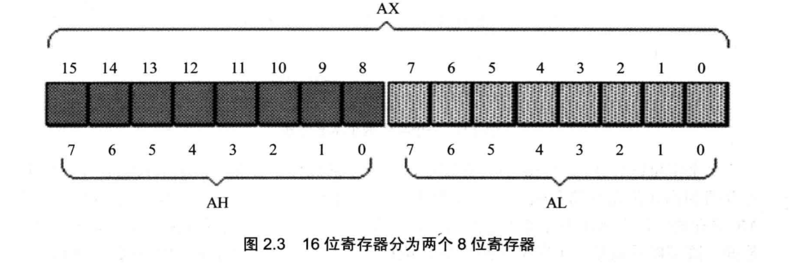
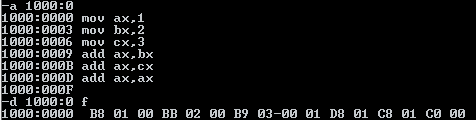

# 8086汇编语言 《王爽》

## 寄存器

> ### 通用寄存器

AX BX CX DX

8086CPU的上一代CPU中的寄存器都是8位的，为了保证兼容，使原来基于上代CPU编写的程序稍加修改就可以运行在8086之上，8086CPU的AX、BX、CX、DX这4个寄存器都可分为两个可独立使用的8位寄存器来用：
- AX可分为 AH，AL 
- BX可分为 BH，BL 
- CX可分为 CH，CL 
- DX可分为 DH，DL 

以AX为例，8086CPU的16位寄存器分为两个8位寄存器


> ### 段寄存器

CS IP

CS 和 IP是8086cpu中两个最关键的寄存器。他指示了cpu当前要读取指令的地方。CS为**代码段寄存器**，IP为**指令指针寄存器**

> #### 修改CS IP的指令
在 CPU 中，程序员能够用指令读写的部件只有寄存器，程序员可以通过改变寄存器中的内容实现对 CPU 的控制。CPU 从何处执行指令是由 CS、IP 中的内容决定的，程序
员可以通过改变CS、IP中的内容来控制 CPU 执行目标指令。

可以修改CS，PC的最简单的指令：jmp指令处取指令

若想同时修改CS，IP的内容，可用形如“jmp 段地址:偏移地址”的指令完成。例如
jmp 2AE3:3 执行后：CS=2AE3H IP=3  CPU将从2AE33H


> #### 字在寄存器中的存储

- 字节 Byte, 一个字节由8个bit组成,可以存在8位寄存器中
- 字 word, 一个字由两个字节组成，这两个字节分别为这个字的高位字节，与地位字节

一个字既可以看成一个1byte数据类型，也可以看成2个8bit数据类型

SI DI SP BP IP CS SS DS 
ES PSW 

> ### 8086cpu给出地址的方法

8086CPU有20位地址总线，可以传送20位地址，达到1MB 寻址能力。8086CPU又是16位结构，在内部一次性处理、传输、暂时存储的地址为 16位。从8086CPU的内部结构来看，如果将地址从内部简单地发出，那么它只能送出16位的地址，表现出的寻址能力只有 64KB。故8086CPU采用一种在内部用两个16位地址合成的方法来形成一个20 位的物理地址。


## debug程序

不区分大小写

R命令  查看，改变cpu寄存器的内容
```armasm

r  查看所有寄存器ax的值
r ax 修改寄存器ax中的值
```

D命令  查看内存中的内容
```
d 1000:0  查看10000H处的内存，但显示8行（每一行16个字节）
d 1000:2 9  查看10002H~10009H的内容
```

E命令  改写内存中的内容
```
e 1000:0 1 2 3 4 5 6...  改写10000H及以后的数据
e 1000:0 + enter 将会逐个地址修改数据，按空格跳过，再次按下enter执行修改
```

U命令 查看内存中机器码含义, 用法和D命令类似
```
u 1000:0  查看10000H处的内存，但显示8行（每一行16个字节）
u 1000:2 9  查看10002H~10009H的内容
```

T命令  执行机器码
```
t 执行cs ip寄存器中指向的指令
```


A命令 以汇编的形式在内存中写入指令



## 汇编指令

mov

add

jmp