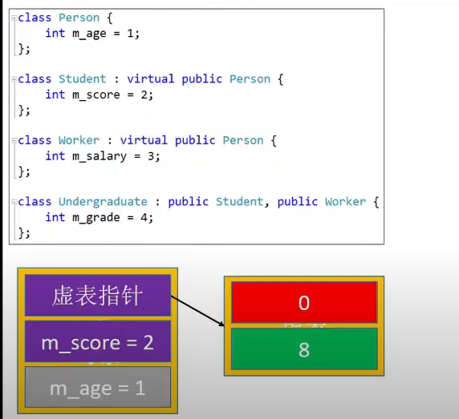
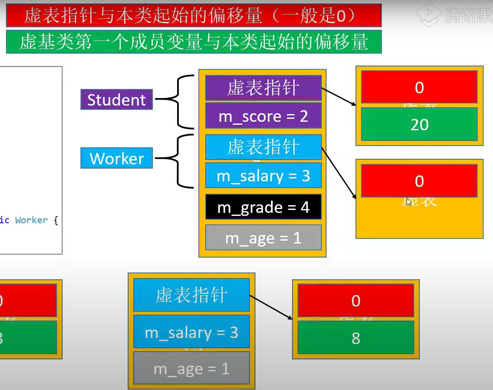

# CPP

## 从c到c++

### 强制类型转换

```cpp
static_cast
const_cast
reinterpret_cast
dynamic_cast

float a;
int b = static_cast<int>(a);
```


### 带有默认参数的函数

为函数的形参的形参指定默认的参数

默认参数只能写在声明中

```cpp
void func1(int a, float b = 3.14);
```

默认参数的使用的规则：
- 默认参数必须出现在非默认参数之后
- 一旦出现了一个默认参数，它后面的参数必须是默认参数
- 一个函数可以全是默认参数

```cpp
void func1(int a, int b = 5);
```
使用规则: 
    默认参数必须

### 函数重载

函数名一定相同，参数的个数，参数的顺序一定有某一项不同，返回值不影响函数重载
```cpp
int add(int a, int b) { return a + b;}
float add(float a, float b) { return a + b;}  // 重载
int add(float a, int b) { return a + b;}    // 重载
float add(int a, int b) { return a + b;}  // 不是重载
```

### 内联函数

关键字
```cpp
inline
```

- 内联函数的作用

    告诉编译器将函数直接展开为函数代码（使用递归就不会展开内联函数）

- 特点

    可以减少函数调用的开销

    增大代码的体积（尽量不要内联超过10行的代码）

- 与宏的异同

    都可以减少函数调用的开销

    宏为字符替换，替换在预处理时期完成
    字符替换容易出现意想不到的结果

    内联函数由编译器实现，展开在编译时完成
    内联函数具有函数特性，拥有语法检查

eg:
```cpp
#define sum(x) (x+x)
inline int sum(int x) {return x + x;}

int a = 10; sum(a++);
// 在这里宏会产生与内联函数不同的结果
```

### const

在c++中， 由const修饰的存储结构是不像c语言那样可以通过指针修改的。因为在c++中的const修饰的存储结构可能存放在只读内存区，通过指针修改const修饰的存储结构，其结果是未定义的，不可预知的。

### 引用（reference）

关键字 &

#### 介绍

- 引用相当于是变量的别名
- 对引用做计算，就是对引用所指向的白能量做计算
- 在定义的时候就不许初始化，一旦指向了某个变量，就不可改变
- 可以利用引用初始化另一个引用，相当于某个变量的多个别名
- 不存在【引用的引用，指向引用的指针，引用数组】

存在的价值：比指针安全

引用的本质

- 引用的本质就是指针，知识编译器削弱了呀的功能，所以引用就是弱化了的指针
- 一个引用占用一个指针的的大小

指针与数组的引用声明

```cpp
//指针的引用
int *p;
int* &ref = p;

///数组的引用
int arr[] = {1,2,3};
int (&ref)[3] = arr;

int num = 3;
int arr[3] = {0};
int (&ref)[sizeof(arr)/sizeof(arr[0])] = arr;

// 指针形式
int arr[] = {1,2,3};
int* const &ref = arr;
```

#### 常引用

引用可以被const修饰，这样就无法通过引用修改数据了，可以称为常引用

```cpp
const int &ref;
int & const ref; // 这种写法没有任何实际意义，引用本身就无法修改
```

const引用的特点

1. 常引用可以引用一个立即数(常量， 表达式，函数返回值)
    ```c
    int &ref = 10;  // 报错
    const int &ref = 10;  // 可行
    ```
2. 可以引用不同类型的数据
3. 作为函数参数时
    - 可以接收const和非const实参（非const引用只能接收非const实参）
    - 可以跟非const引用构成重载
    ```cpp
    int sum(int &v1, int &v2)
    {
        return v1 + v2;
    }
    int sum(const int &v1, const int &v2)
    {
        return v1 + v2;
    }
    int main()
    {
        // 非const实参
        int a = 1, b = 2;
        sum(a, b);  // 调用 int sum(int &v1, int &v2)
    
        // const实参
        const int c = 1, d = 2;
        sum(c, d); // 调用 int sum(const int &v1, const int &v2)
        sum(1, 2); // 调用 int sum(const int &v1, const int &v2)
    }
    ```
4. 当常引用指向了不同类型的数据时，会产生临时变量，即引用指向的并不是初始化时的变量
```cpp
int num = 6;
const double &ref = num;
num = 30;
std::cout<<"num= "<<num<<std::endl;
std::cout<<"ref= "<<ref<<std::endl;
std::cout<<"&num= "<<&num<<std::endl;
std::cout<<"&ref= "<<&ref<<std::endl;

// 结果如下：
// num= 30
// ref= 6
// &num= 0x7fffed562764
// &ref= 0x7fffed562768
```

### 作用域与命名空间

1. 局部域
2. 名字空间域
3. 类域

4. 变量的作用域
    - 局部变量的作用域是局部，
    - 普通全局变量的作用域是整个项目（别的文件可以访问）
    - 静态全局变量的作用域是本文件,在别的文件是不可见的

5. 全局函数的作用域
    - 普通全局函数的作用域是整个项目（别的文件可以访问）
    - 静态全局函数的作用域是本文件，在别的文件是不可见的


## 面向对象

### 类

关键字 class struct

#### class和struct的区别

class默认访问权限 private，默认继承权限也是 private
struct默认访问权限 public，默认继承权限也是 public 

#### this 指针

this 指针是一个隐式变量，在调用类函数时，会自动将类的首地址传给this指针，可以在类内部函数中使用

#### 堆空空间申请

new delete

### 构造函数 constructor

构造函数(也叫构造器)， 在对象创建的时候自动调用，一般用于完成对象的初始化工作

特点

1. 函数名与类同名，无返回值，可以有参数，可以重载，可以有多个构造函数
2. 一旦自定义了构造函数，必须选择用一个自定义的构造函数来初始化对象

```cpp
struct Person
{
    int age;

     Person()
     {
         cout << "Person()" << endl;
     }

    Person(int age)
    {
        if(age < 0)
        {
            age = -1;
        }
        this->age = age;
        cout << "Person(int age)" << endl;
    }

};
```

#### 隐式构造 (explicit关键字)

C++中存在隐式构造的现象：某些情况下，会隐式调用单参数的

使用explicit关键字可以禁用构造函数的隐式构造现象


```cpp
class Person
{
    int a;
    int b;
public:
    Person(int a = 0, int b = 0) : a(a), b(b)
    {
        cout << "Person::Person(int) --- " << this << endl;
    }
    ~Person()
    {
        cout << "Person::~Person() --- " << this << endl;
    }

    void set(int a, int b)
    {
        this->a = a;
        this->b = b;
    }

    void print()
    {
        cout << "a= " << a << ", b= " << b << endl;
    }


};
int main(int argc, char* argv[])
{
    Person p;

    p.print();

    p.set(66, 99);
    p.print();


    int a = 2;
    p = 30;

    p.print();

    return 0;
}
```


### 析构函数 Destructor

析构函数（也叫析构器），在销毁对象的实惠调用，一般用于完成对象后的清理工作

特点

函数名以~开头，与类同名，无返回值，无参，不可以重载，有且只有一个析构函数

通过malloc分配的对象free的时候不会调用构造和析构函数

构造函数与析构函数要设置为public才能正常调用  


### 继承

#### 三种继承方式 public/protected/private

 public、protected、private 修饰类的成员（成员访问限定符）:
    public,protected的成员，是能够通过对象直接访问；
    private的成员，是不能通过对象直接访问，只能通过共有或者保护的接口去访问
    private的成员，在派生类中不可见；protected成员是派生类是可见

public、protected、private 指定继承方式:
不同的继承方式会影响基类成员在派生类中的访问权限,
1. public继承方式
    基类的public成员在派生类是public属性
    基类的protected成员在派生类是protected属性
    基类的private成员在派生类是不可见

2. protected继承方式
    基类的public成员在派生类是protected属性
    基类的protected成员在派生类是protected属性
    基类的private成员在派生类是不可见
    
3. private继承方式
    基类的public成员在派生类是private属性
    基类的protected成员在派生类是private属性
    基类的private成员在派生类是不可见	
总结:
    基类的私有成员在派生类中不可见;
    继承方式决定了基类的成员在派生类中的最高访问权限;
    如果在派生类想访问基类的成员,但是不想通过对象访问它,最好将它设置为protected;

#### 成员访问权限

public 公共的任何地方都可以访问（struct默认）

protected 子类内部，当前类内部可以访问

private 私有的，只有当前内部类可以访问（class默认）

子类内部访问父类的权限，是一下2项权限最小的那个
- 成员本身的访问权限
- 上一级父类的继承方式

开发中用的最多的继承方式是public，这样保留父类原来的成员访问权限

**访问权限不影响类的内存布局**

#### 初始化列表

##### 初始化列表的使用
- 一种便捷的初始化成员变量的方式
- 初始化顺序只与成员声明的顺序有关
- 只能用于构造函数
- 如果声明和实现是分离的，则初始化列表应位于实现

```cpp
Person(int age, int height)
{
    m_age = age;
    m_height = height;
}
// 等价于
// 在原始代码的右值能放什么，括号里就可以放什么
// 括号里的内容和参数列表并无绝对关系
Person(int age, int height) :m_age(age), m_height(height){}

```
与函数的默认参数配合

```cpp
Person(int age = 0, int height = 0) : m_age(m_height), m_height(height){}
// 可以当作无参构造函数使用
Person person;
Person person1(10);
Person person1(10, 20);
// 以上写法皆可行
```


##### 构造函数的互相调用

构造函数的相互调用不能在函数体内直接调用，而应该在初始化列表中调用
```cpp
struct Person{
    int m_age;
    int m_height;

    Person() : Person(0, 0)  // 调用其他的构造函数
    {  
    }

    Person(int age, int height)
    {
        m_age = age;
        m_height = height;
    }

};
```

父类的构造函数

- 子类的构造函数在执行自己的代码之前默认会调用父类的无参构造
- 对于析构函数，子类会在执行完自己的代码后调用父类的析构函数
- 如果子类的构造函数显示的调用了父类的有参构造函数，就不会再去默认调用父类的无参构造函数
- 如果父类缺少无参构造函数，子类的 构造函数必须显示的调用父类的构造函数

显示调用
```cpp
class Person{
    int m_age;
    public:
    Person()
    {
        cout << "Person::Person()" << endl;

    }
    Person(int age)
    {
        m_age = age;
    }
};

class Student : Person{
    int m_no;
public:
    Student(int age) : Person(age)
    {
        cout << "Student::Student()" << endl;

    }
};
```

#### 多继承
```cpp
class D: public A, private B, protected C{
			//类D新增加的成员
		}
```
1. 多继承下的构造函数:
    基类构造函数的调用顺序和和它们在派生类构造函数中出现的顺序无关，而是和声明派生类时基类出现的顺序相同。
    仍然以上面的 A、B、C、D 类为例，即使将 D 类构造函数写作下面的形式：
    D(形参列表): B(实参列表), C(实参列表), A(实参列表){
        //其他操作
    }
    那么也是先调用 A 类的构造函数，再调用 B 类构造函数，最后调用 C 类构造函数。
2. 构造的调用顺序：
    1. 基类的构造（多个基类构造，按照申明派生类时基类出现的顺序）
    2. 派生类的成员变量的构造（多个类对象，按照再派生类中出现的顺序）
    3. 派生类自己的构造
3. 析构的调用顺序：
    与构造的顺序相反
    
4. 命名冲突:
    当两个或多个基类中有同名的成员时，如果直接访问该成员，就会产生命名冲突，编译器不知道使用哪个基类的成员。
    这个时候需要在成员名字前面加上类名和域解析符::，以显式地指明到底使用哪个类的成员
    
5. 在多层级的类的继承关系，A<--B<--C 派生类只负责它的**直接基类**的构造，不能够去做非直接基类的构造


#### 静态成员

静态成员: 被static修饰的成员变量/函数
可以通过对象(对象.静态成员)，对象指针(对象指针->静态成员)，类访问(类::静态成员)

静态成员变量
- 存储在数据段(数据段，类似于全局变量)，整个程序运行过程中只有一份内存‘
- 对比全局变量，它可以设定访问权限（public protected private）,达到局部共享的目的
- 必须初始化，必须在类外面初始化，初始化时不能带static。

静态成员函数
- 内部不能使用this指针
- 不能是虚函数
- 内部不能访问非静态成员变量\函数，只能访问静态成员变量\函数
- 非静态成员函数内部可以访问成员变量\函数
- 构造函数、析构函数不能是静态
- 当声明和实现分离时，实现部分不能带static

#### const类与成员

被修改的成员变量，非静态成员变量

const成员变量
- 必须初始化（内部类初始化），可以在声明的时候直接初始化赋值
- 非static的const成员变量还可以在初始化列表中初始化

const成员函数
- const关键字卸载参数列表后面，函数声明和实现都必须带const
- 内部不能修改非static成员函数
- 内部只能调用const成员函数，static函数
- 非const成员函数可以调用const成员函数
- const成员函数和const成员函数构成重载

const类
- 成员变量均不可被修改
- const对象可以调用const的成员函数，但是不能够调用非const的成员函数
- 非const对象优先调用非const成员函数


#### 友元

当一个函数或者类想访问另外一个类的私有成员的时候，要先成为它的友元

需要注意的地方：
- 友元关系不能继承
- 友元关系是单向的，如果A是B的友元，但B不一定是A的友元，要看有没有友元的申明
- 友元关系不具有传递性，如果B是A的友元，而C是B的友元，那C不一定是A的友元，要看C是否被定义为A的友		
- 友元它破坏了类的封装和隐藏，所以我们要慎用

三种友元
-   友元函数：
    ```cpp
    class Student
    {
    friend void checkId(Student&);
    }
    // 友元函数可以放在共有区域，也能够放到私有区域
    // 一个函数可以是多个类的友元函数，只需要在各个类中分别声明
    // 友元函数的调用和普通函数一样
    ```
    

将一个全局函数声明为类的友元函数，这样的话，这个友元函数就能够访问类对象的私有的成员

友元函数没有类对象的this指针，必须将类对象的指针或者引用传给友元函数


- 友元类
    ```cpp
    friend class Demo;
    //可以声明一个类为另一类的友元类，
    ```
- 友员成员函数
    ```cpp
    class B;
    class A{
    public:
        void func(B&);
    
    }
    class B{
    private:
        int a;
        friend void A::func(B&);
    }
    //可以将A的成员函数func设置为B的友元，这个函数就成为了B的友元成员函数
    ```
#### 拷贝构造

拷贝构造函数，浅拷贝，深拷贝
1. 拷贝函数的定义和语法： 用一个已经存在的类的对象去初始化一个新的类的对象

    当用户自己没有定义自己的拷贝构造函数的时候，系统会给我们生成一个缺省的拷贝构造函数（字节拷贝，把存在对象的数据拷贝到新的对象里头去，称之为浅拷贝）
    ```cpp
    Demo(int a, int b)
    Demo(const　Demo& d)
    {
        aa = d.aa;
        bb = d.bb;
    }
    ```

2. 什么情况下调用拷贝构造
    1. 使用一个存在的对象去初始化一个新的对象
    ```cpp
    Demo d0(1, 2);
    Demo d1(d0);   //方式1
    Demo d2 = d0; //方式2 构造
    d2 = d0; //赋值
    ```
    
    2. 类对象作为一个函数的输入参数　
    ```cpp
    Demo d1(100, 2.2)
    func1(d1);
    ```
    
    3. 从函数里面返回一个类对象   -fno-elide-constructors
    ```cpp
    Demo returnDemo()
    {
        Demo tmp(100, 2.2);
        
        return tmp;
    }
    ```

3. 缺省拷贝构造(浅拷贝)
    当用户自己没有定义自己的拷贝构造函数的时候，系统会提供缺省的拷贝构造函数，它会一个字节一个字节的进行拷贝，这种行为我们称之为“浅拷贝”

4. 自定义拷贝构造(深拷贝)
    针对类需要从堆空间动态申请内存的情况，用户要定义自己的拷贝构造函数，申请相同的内存，然后复制相应的数据，避免内存二次释放导致系统崩溃

5. 调用父类的拷贝构造函数
    在调用父类的深拷贝构造函数时，应在子类的拷贝构造函数的初始化列表中调用父类的拷贝构造函数
    ```cpp
    class Person
    {
        int m_age;
    
    public:
        Person(int m_age = 0) : m_age(m_age){}
        Person(const Person &p) : m_age(p.m_age){}
    };
    
    class Student : Person
    {
        int m_score;
    public:
        Student(int m_age, int m_score) : Person(m_age), m_score(m_score){}
        Student(const Student& stu) : Person(stu), m_score(stu.m_score){}
    
    };
    ```


#### 运算符重载

现有的运算符只能够对基础的数据类型起作用，对于用户自定义的类不起作用，需要重新定义这些运算符，赋予其新的功能，让这些运算符能够对类的对象工作运算符重载的本质是函数重载
    
运算符重载的概念和语法
```cpp
<返回值的数据类型> operator<运算符符号> （<参数列表>）
{
    //函数体
}	
```

友员运算符重载
```cpp
class Point
{
    friend <返回值的数据类型> operator<运算符符号> （<参数列表>）;

}
<返回值的数据类型> operator<运算符符号> （<参数列表>）
{
    //函数体
}
```
实现的是类的外部，作为全局函数来实现，既然是友元运算符重载，不能使用类的this指针，所以对单目运算符，它需要1个参数；对于二目运算符，它需要2个参数
但是对于a++和aa--，虽然是单目运算符，但是为了和++a,--a区分，需要一个额外的参数，并且这个参数必须是int的


成员运算符重载（成员函数）	

```cpp
class Point
{
    <返回值的数据类型> operator<运算符符号> （<参数列表>）
    {
        //函数体
    }
}
```
定义在类里面，实现可以在类里面，也可以在类的外面；既然是成员运算符重载，能够使用this指针，那对于单目运算符，不需要参数；对于二目运算符，它需要1个参数；对于二目运算符，它需要2个参数
但是对于a++和aa--，虽然是单目运算符，但是为了和++a,--a区分，需要一个额外的参数，并且这个参数必须是int的	


### 多态

父类指针与子类指针

在没有虚函数的情况下，**调用类函数是根据类的类型或类指针的类型直接调用的**
**父类指针可以指向子类对象（向上转型），是安全的**，开发中经常用到（继承方式必须是public）
**向下转型是不安全的**

多态是面向对象非常重要的一个特性
>- 同一个操作作用于不同的对象，可以有不同的解释，产生不同的执行结果
>- 在运行时，可以识别出真正的对象类型，调用对应子类中的函数

多态的要素
>- 子类重写父类的成员函数（override）
>- 父类指针指向子类对象
>- 利用父类指针调用重写的成员函数

#### 虚函数

关键字 virtual

##### 虚函数
- 虚函数: 被virtual修饰的成员函数
- 只要被父类中声明为虚函数，子类重写的函数也会自动变成虚函数（也就是说子类中可以省略）
- 虚函数只能定义**非静态**成员函数
- 构造函数不能声明为虚函数，但析构函数可以

```cpp
#include <iostream>
using namespace std;

struct Animal
{
    virtual void speak()
    {
        cout << "Animal is Speak!" << endl;
    }
    virtual void run()
    {
        cout << "Animal is Run!" << endl;
    }
};

struct Cat : Animal
{
    void speak()
    {
        cout << "Cat is Speak!" << endl;
    }
    void run()
    {
        cout << "Cat is Run!" << endl;
    }
};

struct Dog : Animal
{
    void speak()
    {
        cout << "Dog is Speak!" << endl;
    }
    void run()
    {
        cout << "Dog is Run!" << endl;
    }
};

struct Pig : Animal
{
    void speak()
    {
        cout << "Pig is Speak!" << endl;
    }
    void run()
    {
        cout << "Pig is Run!" << endl;
    }
};


```

##### 函数的重写（override）（重写实现了多态）
- 不同的作用域
- 函数名相同
- 参数相同
- 返回值类型相同
- 重写函数的权限访问限定符可以不同

```cpp
class Base
{ 
public:
    Base(){}
    ~Base(){}
    virtual void func1(int a, int b)
    {
        cout << "Base::func1(int, int), " << a << "," << b << endl;
    }
};
class Derived : public Base
{  
public:
    Derived(){}
    ~Derived(){}   
    virtual void func1(int a, int b)
    {
        cout << "Derived::func1(int, int), " << a << "," << b << endl;
    }
};

```

##### 函数的隐藏（无法直接调用父类函数，可以通过父类的域访问修饰符调用）
- 不同的作用域
- 函数名相同
- 没有重写现象
- 函数的隐藏解决了多继承下的父类同名函数的调用混淆

```cpp
class Base
{
    
public:
    Base(){}
    ~Base(){}
    
    void func1(float a, int b)
    {
        cout << "Base::func1(int, int), " << a << "," << b << endl;
    }
};
class Derived : public Base
{
public:
    Derived(){}
    ~Derived(){}
    
    int func()
    {
        cout << "Derived::func1()" << endl;
        return 0;
    }

};
```

#### 虚表

虚函数的实现原理是虚表，这个虚表里面存储着最终要调用的虚函数地址，这个虚表也叫虚函数表

有虚函数的的类的内存空间布局


关于虚表的细节

虚表的内存地址为类的首地址
只要有虚函数，就会有虚表。虚表中的函数为从子类到父类第一个出现的虚函数

```cpp
#include <iostream>
using namespace std;

struct Animal
{
    void speak()
    {
        cout << "Animal is Speak!" << endl;
    }
    void run()
    {
        cout << "Animal is Run!" << endl;
    }
};

struct Cat : Animal  // 由于父类没有虚函数，所以该类在被创建时没有创建虚表，所以使用多态的方式调用该类函数时，直接调用的父类的函数
{
    virtual void speak()
    {
        cout << "Cat is Speak!" << endl;
    }
    virtual void run()
    {
        cout << "Cat is Run!" << endl;
    }
};


struct smallCat : Animal  // 父类的函数为虚函数，重写的函数继承虚函数特性，在类的首地址连接一个虚表
{                           // 虚表中的函数为所有的虚函数，并且虚表中的函数为从子类到父类第一个出现的虚函数
    void speak()
    {
        cout << "smallCat is Speak!" << endl;
    }
    void run()
    {
        cout << "smallCat is Run!" << endl;
    }
};


```

#### 调用父类的的成员函数

在需要调用父类的成员函数时，只需要在子类中使用父类的访问修饰符
```cpp
class A
{
    func1();
}
class B : public A;

main

B b;
b.A::func1(); // 使用父类的访问修饰符
```

#### 虚析构函数

由于指针指向的对象是基类类型，所以delete销毁对象的时候，并不会调用派生类的析构函数，这样就造成了对象销毁不完整，所有需要将析构函数定义为虚函数

当存在父类指针指向子类时(多态), 需要将父类的析构函数声明为virtual

如此，delete父指针时，才会调用子类的析构函数，保证析构的完整性


```cpp
struct Animal
{
    int m_age;
    virtual void speak()
    {
        cout << "Animal is Speak!" << endl;
    }
    virtual void run()
    {
        cout << "Animal is Run!" << endl;
    }
    Animal(){
        cout << "Animal::Animal()" << endl; 
    }
    virtual ~Animal(){
        cout << "Animal::~Animal()" << endl; 
    }
};

struct Cat : Animal
{
    int mylife;
    void speak()
    {
        cout << "Cat is Speak!" << endl;
    }
    void run()
    {
        cout << "Cat is Run!" << endl;
    }
    Cat(){
        cout << "Cat::Cat()" << endl; 
    }
    ~Cat(){
        cout << "Cat::~Cat()" << endl; 
    }
};
```

#### 纯虚函数(抽象类)

- 纯虚函数：没有函数体，且初始化为0的虚函数，用来定义接口规范
- 抽象类 （Abstract Class）
    - 含有纯虚函数的类，不可以实例化（不可以创建对象）
    - 抽象类也可以包含非纯虚函数，成员变量
    - 如果父类是抽象函数，子类没有完全重写纯虚函数，那么这个子类依然是抽象类


### 虚基类

虚继承和虚基类
class B: virtual public A{
    //类B新增加的成员
}	  

1. 类 A 派生出类 B1 和类 B2，类 C 继承自类 B1 和类 B2，这个时候类 A 中的成员变量和成员函数继承到类 C 中变成了两份，
一份来自 A-->B1-->C 这条路径，另一份来自 A-->B2-->C 这条路径 （菱形继承）
因为保留多份成员变量不仅占用较多的存储空间，还容易产生命名冲突
为了解决多继承时的命名冲突和冗余数据问题，C++ 提出了虚继承，使得在派生类中只保留一份间接基类的成员

2. 虚继承的目的是让某个类做出声明，承诺愿意共享它的基类。其中，这个被共享的基类就称为虚基类（Virtual Base Class），
A就是一个虚基类。在这种机制下，不论虚基类在继承体系中出现了多少次，在派生类中都只包含一份虚基类的成员

3. 在虚继承中，虚基类是由最终的派生类初始化的，换句话说，最终派生类的构造函数必须要调用虚基类的构造函数。
对最终的派生类来说，虚基类是间接基类，而不是直接基类。这跟普通继承不同，在普通继承中，派生类构造函数中只能调用直接基类的构造函数，不能调用间接基类的  

#### 虚基类的原理



每个以虚继承的方式继承的父类都有一个虚表指针，其虚表指针指向的是虚基类的的成员的偏移地址。而且其继承的虚基类成员如图所示，其成员在整个对象的最后。而虚表指针位于对象的开始。当子类继承他们时，类成员会依次按规则排列，其虚表指针分别都指向了唯一的位于对象最后的虚基类成员

