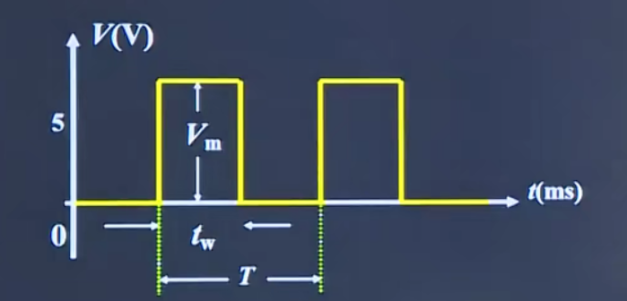

# 数字电路与模拟电路

## 数字电路

### 数字电路基础

#### 基本概念

##### 模拟信号与数字信号

* 模拟信号--时间连续数值也连续的信号
* 数字信号--在时间上和数字上均是离散的

数字信号在电路中长表现为突变的电压或电流

##### 正逻辑与负逻辑

数字信号是一种二值信号，用两个电平（高电平和低电平）分别来表示两个逻辑值（逻辑1 和 逻辑0）

##### 两种逻辑体制

正逻辑体制：高电平为逻辑1，低电平为逻辑0
负逻辑体制：低电平为逻辑1，高电平为逻辑0

##### 数字信号的主要参数

一个理想的周期性数字信号，可以用以下几个参数来描绘

* Vm--信号幅度
* T---信号的重复周期
* tw--脉冲宽度
* q---占空比  其定义为 q% = tw/T * 100%

##### 数字电路分类

按集成度分类

数字电路可分为小规模（SSI，每片数十器件）、中规模(MSI，每片数百器件)、大规模（LSI，每片数千器件）和超大规模（VLSI，每片器件数目大于1万）数字集成电路。集成电路从应用的角度又可分为通用型和专用型两大类型。

按所用器件制作工艺的不同

数字电路可分为双极型（TTL型）和单极型（MOS型）两类。

按照电路的结构和工作原理的不同

数字电路可分为组合逻辑电路和时序逻辑电路两类。组合逻辑电路没有记忆功能，其输出信号只与当时的输入信号有关，而与电路以前的状态无关。时序逻辑电路具有记忆功能，其输出信号不仅和当时的输入信号有关，而且与电路以前的状态有关。

##### 基本逻辑运算

基本公式

|  名称  |        公式1        |           公式2           |
| :----: | :-----------------: | :-----------------------: |
| 0-1律  |      A * 1 = A      |         A + 0 = A         |
|        |      A * 0 = 0      |         A + 1 = 1         |
| 互补律 |     A（~A） = 0     |       A + (~A) = 1        |
| 重叠律 |      A * A = A      |         A + A = A         |
| 交换律 |    A \* B = B \* A    |       A + B = B + A       |
| 结合律 |    A(BC) = (AB)C    | A + (B + C) = (A + B) + C |
| 分配律 | A(B + C) = AB + AC  | A + (BC) = (A + B)(A + C) |
| 反演律 | ~(AB) = (~A) + (~B) |  ~(A + B) = (~A) * (~B)   |
| 吸收律 |    A(A + B) = A     |        A + AB = A         |
|        |  A(~(A) + B) = AB   |    A + ((~A)B) = A + B    |
| 对合律 |       ~~A = A       |                           |

##### 逻辑函数及其表达方式

### 组合逻辑电路 

## 模拟电路

