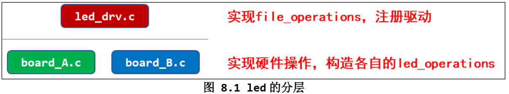

# linux_driver

## 字符设备驱动

### 简单的字符设备驱动框架

1. 确定主设备号，也可以让内核分配  int major;  major = 0 时自动分配
2. 定义自己的 file_operations 结构体
3. 实现对应的 drv_open/drv_read/drv_write 等函数，填入 file_operations 结构体
4. 把 file_operations 结构体告诉内核： register_chrdev
5. 谁来注册驱动程序啊？得有一个入口函数：安装驱动程序时，就会去调用这个入口函数
6. 有入口函数就应该有出口函数：卸载驱动程序时，出口函数调用 unregister_chrdev
7. 其他完善：提供设备信息，自动创建设备节点： class_create, device_crea


register_chrdev方式，register_chrdev会使用整个主设备号,使用简单，但占用资源较大
```c
#include "asm/uaccess.h"
#include "linux/err.h"
#include "linux/export.h"
#include "linux/kdev_t.h"
#include "linux/moduleparam.h"
#include "linux/printk.h"
#include "linux/stddef.h"
#include "linux/usb/cdc.h"
#include <linux/module.h>
#include <linux/fs.h>
#include <linux/errno.h>
#include <linux/miscdevice.h>
#include <linux/kernel.h>
#include <linux/major.h>
#include <linux/mutex.h>
#include <linux/proc_fs.h>
#include <linux/seq_file.h>
#include <linux/stat.h>
#include <linux/init.h>
#include <linux/device.h>
#include <linux/tty.h>
#include <linux/kmod.h>
#include <linux/gfp.h>

#define MIN(a, b) (a < b ? a : b)


// 1. 确定主设备号 0自动分配
static int major = 0;
static char kernel_buf[1024];
MODULE_LICENSE("GPL");

struct class* hello_class;


// 3. 填充file_operations
int hello_open (struct inode *node, struct file *file)
{
    printk("%s %s line %d", __FILE__, __FUNCTION__, __LINE__);
    return 0;
}
ssize_t hello_read (struct file *file, char __user *buf, size_t size, loff_t *l)
{
    int ret;
    printk("%s %s line %d", __FILE__, __FUNCTION__, __LINE__);
    ret = copy_to_user(buf, kernel_buf, MIN(1024, size));
    return ret;
}
ssize_t hello_write (struct file *file, const char __user *buf, size_t size, loff_t *l)
{
    int ret;
    printk("%s %s line %d", __FILE__, __FUNCTION__, __LINE__);
    ret = copy_from_user(kernel_buf, buf, MIN(1024, size));
    return ret;
}
int hello_close (struct inode *node, struct file *file)
{
    printk("%s %s line %d", __FILE__, __FUNCTION__, __LINE__);
    return 0;
}

// 2. 定义自己的 file_operations 结构体

struct file_operations operations= {
    .read = hello_read,
    .open = hello_open,
    .write = hello_write,
    .release = hello_close,
};

static int __init hello_drv_init(void)
{
    int err;

    printk("%s %s line %d\n", __FILE__, __FUNCTION__, __LINE__);

// 4. 申请设备号，并将模块添加到内核中
    major = register_chrdev(major, "hello", &operations);


    // 创建设备文件
    hello_class = class_create(THIS_MODULE, "hello_class");
    err = PTR_ERR(hello_class);
	if (IS_ERR(hello_class)) {
		printk("%s %s line %d\n", __FILE__, __FUNCTION__, __LINE__);
		unregister_chrdev(major, "hello");
		return -1;
	}

    device_create(hello_class, NULL, MKDEV(major, 0), NULL, "hello");

    return 0; 
}

// 6. 有入口函数就应该有出口函数：卸载驱动程序时，出口函数调用 unregister_chrdev
static void __exit hello_drv_exit(void)
{
    printk("%s %s line %d\n", __FILE__, __FUNCTION__, __LINE__);
    device_destroy(hello_class, MKDEV(major, 0));
    class_destroy(hello_class);
    unregister_chrdev(0, "hello");
}
// 7. 其他完善：提供设备信息，自动创建设备节点：class_create,device_create

module_init(hello_drv_init);
module_exit(hello_drv_exit);
```

```makefile
# 1. 使用不同的开发板内核时, 一定要修改KERN_DIR
# 2. KERN_DIR中的内核要事先配置、编译, 为了能编译内核, 要先设置下列环境变量:
# 2.1 ARCH,          比如: export ARCH=arm64
# 2.2 CROSS_COMPILE, 比如: export CROSS_COMPILE=aarch64-linux-gnu-
# 2.3 PATH,          比如: export PATH=$PATH:/home/book/100ask_roc-rk3399-pc/ToolChain-6.3.1/gcc-linaro-6.3.1-2017.05-x86_64_aarch64-linux-gnu/bin 
# 注意: 不同的开发板不同的编译器上述3个环境变量不一定相同,
#       请参考各开发板的高级用户使用手册

KERN_DIR = /home/book/100ask_imx6ull-sdk/Linux-4.9.88

all:
	make -C $(KERN_DIR) M=`pwd` modules 
	$(CROSS_COMPILE)gcc -o hello_test hello.c 

clean:
	make -C $(KERN_DIR) M=`pwd` modules clean
	rm -rf modules.order
	rm -f hello_drv

obj-m	+= hello_drv.o

```

### 驱动设计的思想

- 面向对象

针对led驱动，字符设备驱动抽象出file_operations结构体，我们写的程序也可以抽象出led_operations结构体
```c
struct led_operations{
    int (*init) (int which);  // 根据次设备号初始化led
    int (*ctl) (int which, char status);
    int (*read) (int which, char* status);
    int (*release) (int which);
};
// 提供了一些方法，提供给上层使用。类似于java中类的方法
struct led_operations* get_board_led_opr(void);
int get_board_led_num(void);

```

- 分层

将与硬件相关与硬件无关的代码分离


- 分离
将不同的引脚操作进行分离，比如GPIO1与GPIO2的硬件设置不同就导致了相关的代码不同
使用文件进行分离


## 驱动进化之路 —- 总线设备驱动模型


